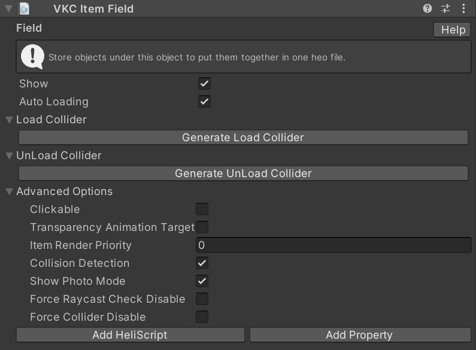

# VKC Item Field
Objects with VKC Item Field attached will be packed into .heo during BuildAndRun. Make sure to set objects you want to include in the .heo file as children of the object with VKC Item Field.

For tips on how to place VKC Item Field, see [Tips on using VKC Item Field](../WorldMakingGuide/HEOFieldTips.md).

## Configuration Settings

| Label | Initial Value | Function |
| ---- | ---- | ---- |
| Show | true | Sets the display state of objects |
| Auto Loading | true | Toggles auto loading enable/disable |
| Load Collider |  | Generates a collider that will load a designated object on enter |
| UnLoad Collider |  | Generates a collider that will unload a designated object on enter |

!!! info "Note"
    VKC Item Field can be placed multiple times in a scene.

!!! info "Note"
    The `Billboard` setting in pre-Ver9.3 components has been renamed to `Look at Camera`. 
    If the scene data is migrated from past SDK versions, the `Billboard` setting value will be reflected to `Look at Camera`.

???+ note "Available methods for this object type"
    - [Equals](../hs/hs_class_item.md#equals)
    - [GetName](../hs/hs_class_item.md#getname)
    - [GetPos](../hs/hs_class_item.md#getpos)
    - [GetWorldPos](../hs/hs_class_item.md#getworldpos)
    - [SetQuaternion](../hs/hs_class_item.md#setquaternion)
    - [GetQuaternion](../hs/hs_class_item.md#getquaternion)
    - [GetWorldQuaternion](../hs/hs_class_item.md#getworldquaternion)
    - [GetWorldRotate](../hs/hs_class_item.md#getworldrotate)
    - [GetScale](../hs/hs_class_item.md#getscale)
    - [SetScale](../hs/hs_class_item.md#setscale)
    - [SetShow](../hs/hs_class_item.md#setshow)
    - [IsShow](../hs/hs_class_item.md#isshow)
    - [Load](../hs/hs_class_item.md#load)
    - [Unload](../hs/hs_class_item.md#unload)
    - [IsLoading](../hs/hs_class_item.md#isloading)
    - [IsLoaded](../hs/hs_class_item.md#isloaded)
    - [GetNodeIndexByName](../hs/hs_class_item.md#getnodeindexbyname)
    - [GetNodeNameByIndex](../hs/hs_class_item.md#getnodenamebyindex)
    - [GetNodePosByIndex](../hs/hs_class_item.md#getnodeposbyindex)
    - [SetShowNode](../hs/hs_class_item.md#setshownode)
    - [IsShowNode](../hs/hs_class_item.md#isshownode)
    - [SetRotateNode](../hs/hs_class_item.md#setrotatenode)
    - [SetEnableCollider](../hs/hs_class_item.md#setenablecollider)
    - [IsEnableCollider](../hs/hs_class_item.md#isenablecollider)
    - [SetClickableNode](../hs/hs_class_item.md#setclickablenode)
    - [IsClickableNode](../hs/hs_class_item.md#isclickablenode)
    - [SetUVOffset](../hs/hs_class_item.md#setuvoffset)
    - [PlayVideo](../hs/hs_class_item.md#playvideo)
    - [StopVideo](../hs/hs_class_item.md#stopvideo)
    - [IsPlayVideo](../hs/hs_class_item.md#isplayvideo)
    - [ReplaceItem](../hs/hs_class_item.md#replacetexture)
    - [ReplaceTexture](../hs/hs_class_item.md#replaceitem)
    - [SetPhysicsEnable](../hs/hs_class_item.md#setphysicsenable)
    - [IsPhysicsFixed](../hs/hs_class_item.md#isphysicsfixed)
    - [GetPhysicsIDByNodeName](../hs/hs_class_item.md#getphysicsidbynodename)
    - [SetProperty](../hs/hs_class_item.md#setproperty)
    - [GetProperty](../hs/hs_class_item.md#getproperty)
    - [CallComponentMethod](../hs/hs_class_item.md#callcomponentmethod)
    - [SetOverridesProperty](../hs/hs_class_item.md#setoverridesproperty)
    - [GetOverridesProperty](../hs/hs_class_item.md#getoverridesproperty)

### Advanced Options

| Label | Default | Function |
| ---- | ---- | ---- |
| Clickable | false | Allows click the object |
| Alpha Animation Target | false | Becomes transparent when obstructing the camera |
| Item Render Priority | 0 | Sets the item rendering priority |
| Collision Detection | true | Toggles whether object collision detection is enabled|
| Show Photo Mode | true | Specifies whether it is displayed in photo mode |
| Force Raycast Check Disable | false | Sets whether to forcibly disable raycast detection per item |
| Force Collider Disable | false | Forcibly disables the collider |

!!! warning "Force Collider Disable is not available in the stable SDK 14.4.12"
    Force Collider Disable cannot be used in the stable SDK 14.4.12 because its functionality has been rolled back.
    If you have SDK 14.2.1 or any version later than 14.4.12, please use that instead.

## Dynamic Loading Configuration

Unchecking Auto Loading will disable automatic loading when entering the world. 
These objects with automatic loading disabled can still be dynamically loaded at any time. 
Below, we introduce how to configure this using the VKC Item Area Collider component. 

### Loading when entering an area collider

1. Attach a VKC Item Field component to the object you want to load dynamically and uncheck "Auto Loading".
2. Next, open the "Load Collider" item below and press the "Generate Load Collider" button.
3. Confirm that an object named "LoadArea_GameObject_0" has been generated at the top level of the hierarchy. This object has the VKC Item Area Collider component attached.
4. Create a new object with a VKC Item Field component, and move "LoadArea_GameObject_0" under the hierarchy of this newly created object.
5. Adjust the Box Collider of "LoadArea_GameObject_0" as it will be the detection area for the trigger, so adjust its position and size accordingly.

!!! info "Reason for moving 'LoadArea_GameObject_0' under another object's hierarchy"
    In VketCloud, VKC Item Field is used to output collider shapes and other forms.
    Therefore, an Area Collider type item alone cannot build the collider shape.

### Unloading when entering an area collider

1. Open the Unload Collider item and press "Generate Unload Collider" to generate an area collider to be used for unloading.
2. Confirm that an object named "UnLoadArea_GameObject_0" has been generated at the top level of the hierarchy. This object has the VKC Item Area Collider component.
3. Since VKC Item Area Collider needs to be a child object of another VKC Item Field, create a new object with a VKC Item Field component. This object needs to keep Auto Loading enabled.
4. Move "UnLoadArea_GameObject_0" under the hierarchy of this newly created object.
5. Adjust the Box Collider of "UnLoadArea_GameObject_0" to adjust the position and size of the trigger area.

!!! warning "caution"
    The set colliders can be deleted from the list by pressing the X button on the right side of each item, but the objects will remain and must be deleted manually.

!!! info "Dynamic loading using HeliScript"
    Using HeliScript, you can perform dynamic loading without using VKC Item Area Collider.
    For details, please refer to the Load/Unload items.
    - [Load](../hs/hs_class_item.md#load)
    - [Unload](../hs/hs_class_item.md#unload)

---

### Reference
[DoorOpensAfterLoad](../WorldMakingGuide/DoorOpensAfterLoad.md)