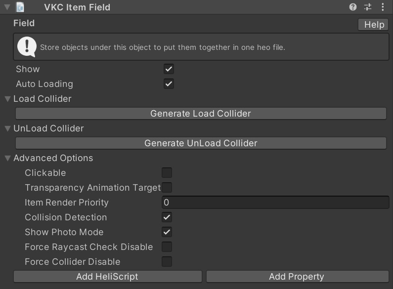

# VKC Item Field

VKC Item Fieldがアタッチされたオブジェクトは、BuildAndRun時に.heoとしてパックされます。.heoファイルに含めたいオブジェクトは、必ずVKC Item Field以下に配置してください。

VKC Item Fieldの詳しい配置方法については[VKC Item Fieldの使い方](../WorldMakingGuide/HEOFieldTips.md)を参照ください。

## 設定項目

| 名称 | 初期値 | 機能 |
| ---- | ---- | ---- |
| Show | true | オブジェクトの表示状態を管理します |
| Auto Loading | true | 自動ローディングの有効/無効を切り替えます |
| Load Collider |  | 範囲に入った際に特定のオブジェクトをロードするコライダーを生成します |
| UnLoad Collider |  | 範囲に入った際に特定のオブジェクトをアンロードするコライダーを生成します |

!!! info "Note"
    VKC Item Fieldはシーンに複数配置することができます。

!!! info "Note"
    Ver9.3以前の`Billboard`設定は`Look at Camera`に名称が変更されました。 
    以前のSDKバージョンからシーンデータを移植した場合、`Billboard`の設定は`Look at Camera`に引き継がれます。

???+ note "このオブジェクトタイプを使用可能なItemクラス"
    - [Equals](../hs/hs_class_item.md#equals)
    - [GetName](../hs/hs_class_item.md#getname)
    - [GetPos](../hs/hs_class_item.md#getpos)
    - [GetWorldPos](../hs/hs_class_item.md#getworldpos)
    - [SetQuaternion](../hs/hs_class_item.md#setquaternion)
    - [GetQuaternion](../hs/hs_class_item.md#getquaternion)
    - [GetWorldQuaternion](../hs/hs_class_item.md#getworldquaternion)
    - [GetWorldRotate](../hs/hs_class_item.md#getworldrotate)
    - [GetScale](../hs/hs_class_item.md#getscale)
    - [SetScale](../hs/hs_class_item.md#setscale)
    - [SetShow](../hs/hs_class_item.md#setshow)
    - [IsShow](../hs/hs_class_item.md#isshow)
    - [Load](../hs/hs_class_item.md#load)
    - [Unload](../hs/hs_class_item.md#unload)
    - [IsLoading](../hs/hs_class_item.md#isloading)
    - [IsLoaded](../hs/hs_class_item.md#isloaded)
    - [GetNodeIndexByName](../hs/hs_class_item.md#getnodeindexbyname)
    - [GetNodeNameByIndex](../hs/hs_class_item.md#getnodenamebyindex)
    - [GetNodePosByIndex](../hs/hs_class_item.md#getnodeposbyindex)
    - [SetShowNode](../hs/hs_class_item.md#setshownode)
    - [IsShowNode](../hs/hs_class_item.md#isshownode)
    - [SetRotateNode](../hs/hs_class_item.md#setrotatenode)
    - [SetEnableCollider](../hs/hs_class_item.md#setenablecollider)
    - [IsEnableCollider](../hs/hs_class_item.md#isenablecollider)
    - [SetClickableNode](../hs/hs_class_item.md#setclickablenode)
    - [IsClickableNode](../hs/hs_class_item.md#isclickablenode)
    - [SetUVOffset](../hs/hs_class_item.md#setuvoffset)
    - [PlayVideo](../hs/hs_class_item.md#playvideo)
    - [StopVideo](../hs/hs_class_item.md#stopvideo)
    - [IsPlayVideo](../hs/hs_class_item.md#isplayvideo)
    - [ReplaceItem](../hs/hs_class_item.md#replacetexture)
    - [ReplaceTexture](../hs/hs_class_item.md#replaceitem)
    - [SetPhysicsEnable](../hs/hs_class_item.md#setphysicsenable)
    - [IsPhysicsFixed](../hs/hs_class_item.md#isphysicsfixed)
    - [GetPhysicsIDByNodeName](../hs/hs_class_item.md#getphysicsidbynodename)
    - [SetProperty](../hs/hs_class_item.md#setproperty)
    - [GetProperty](../hs/hs_class_item.md#getproperty)
    - [CallComponentMethod](../hs/hs_class_item.md#callcomponentmethod)
    - [SetOverridesProperty](../hs/hs_class_item.md#setoverridesproperty)
    - [GetOverridesProperty](../hs/hs_class_item.md#getoverridesproperty)

### 高度な設定

| 名称 | 初期値 | 機能 |
| ---- | ---- | ---- |
| Clickable | false | クリックできるようになります |
| Alpha Animation Target | false | カメラを遮ったときに透過されます |
| Item Render Priority |  0 | アイテムレンダー優先度を設定します |
| Collision Detection | true | オブジェクトの衝突判定を検知するか切り替えます |
| Show Photo Mode | true | 撮影モードで表示されるかどうかを指定します | 
| Force Raycast Check Disable | false | Item単位でraycastの判定を強制的に無効にするかどうかを設定します |
| Force Collider Disable | false | 強制的にコライダーを無効にします |

!!! warning "Force Collider Disableは安定版SDK14.4.12でご使用いただけません"
    Force Collider Disableは安定版SDK14.4.12で機能がロールバックのためご使用いただけません。
    SDK14.2.1もしくは14.4.12より新しいバージョンがあれば、そちらをご使用ください。

## 動的ローディングの設定方法

Auto Loading のチェックを外すことで、ワールド入場時の自動ローディングが無効になります。 
これら自動ローディングを無効にしたオブジェクトでも、任意のタイミングで動的ローディングが可能です。 
下記ではVKC Item Area Colliderコンポーネントを使用した設定方法を紹介します。 

### エリアコライダーに侵入したときにロードする

1. 動的ローディングしたいオブジェクトにVKC Item Fieldコンポーネントをアタッチして、「自動ローディング」のチェックを外す。
2. さらに、その下にある項目「ロードコライダー」を開き、「ロードコライダー生成」ボタンを押します。
3. 「LoadArea_GameObject_0」という名前のオブジェクトがヒエラルキーのトップ階層に生成されていることを確認します。このオブジェクトはVKC Item Area Colliderコンポーネントがアタッチされています。
4. VKC Item Fieldをもつオブジェクトを新しく作成し、作成したオブジェクトの階層下に「LoadArea_GameObject_0」を移動します。
5. 「LoadArea_GameObject_0」のBox Colliderのエリアが検知範囲となるため、位置やサイズを調整します。

!!! info "「LoadArea_GameObject_0」を他のオブジェクトの階層下に移動する理由"
    VketCloudではコライダーなどの形状を出力するために、VKC Item Fieldを使用しています。
    そのため、Area Colliderタイプのアイテム単体だと、コライダーの形状をビルドできません。

### エリアコライダーに侵入したときにアンロードする

1. アンロードコライダーの項目を開き、「アンロードコライダー生成」を押してロードに使うエリアコライダーを生成する。
2. 「UnLoadArea_GameObject_0」という名前のオブジェクトがヒエラルキーのトップ階層に生成されていることを確認します。このオブジェクトはVKC Item Area Colliderコンポーネントを持っています。
3. VKC Item Area Colliderは、別のVKC Item Fieldの子オブジェクトにする必要があるため、VKC Item Fieldをもつオブジェクトを新しく作成します。このオブジェクトは自動ローディングを有効のままにしておく必要があります。
4. 新しく作成したオブジェクトの階層下に、「UnLoadArea_GameObject_0」を移動します。
5. トリガーとなるエリアの位置やサイズを調整するため、「UnLoadArea_GameObject_0」のBox Colliderを調整します。

!!! warning "caution"
    設定されたコライダーは、各項目の右側にあるXボタンを押すことでリストから消すことができますが、オブジェクトは残ったままになるので、そちらは手動で削除が必要になります。

!!! info "HeliScriptによる動的ローディング"
    HeliScriptを使用することで、VKC Item Area Colliderを使用せずに動的ローディングが可能です。
    詳細はLoad/Unloadの項目を参照してください。
    - [Load](../hs/hs_class_item.md#load)
    - [Unload](../hs/hs_class_item.md#unload)

---

### 参考
[ロードが完了したら開く扉](../WorldMakingGuide/DoorOpensAfterLoad.md)
