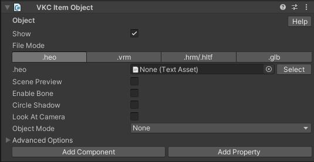
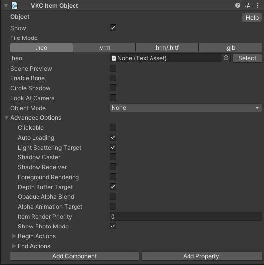
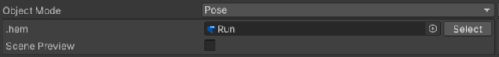
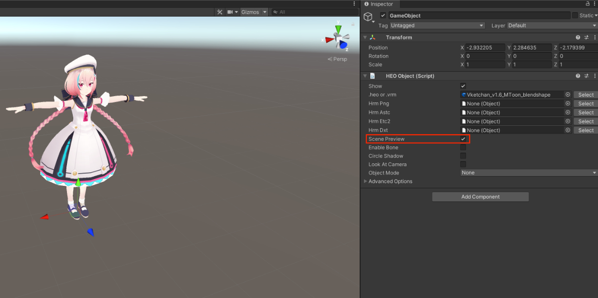
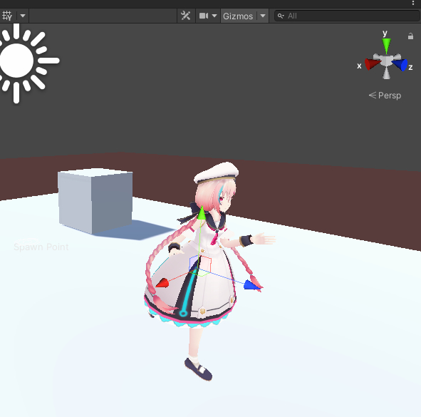

# VKC Item Object

VKC Item Object is used to instantiate a dynamic object, which is based on a pre-exported .heo file, or using a vrm, [hrm](../WorldOptimization/TextureCompression.md), or glb format model.

???+ note "Available methods for this object type"
    - [Equals](../hs/hs_class_item.md#equals)
    - [GetName](../hs/hs_class_item.md#getname)
    - [GetPos](../hs/hs_class_item.md#getpos)
    - [GetWorldPos](../hs/hs_class_item.md#getworldpos)z
    - [SetQuaternion](../hs/hs_class_item.md#setquaternion)
    - [GetQuaternion](../hs/hs_class_item.md#getquaternion)
    - [GetWorldQuaternion](../hs/hs_class_item.md#getworldquaternion)
    - [GetWorldRotate](../hs/hs_class_item.md#getworldrotate)
    - [GetScale](../hs/hs_class_item.md#getscale)
    - [SetScale](../hs/hs_class_item.md#setscale)
    - [MovePos](../hs/hs_class_item.md#movepos)
    - [IsMoving](../hs/hs_class_item.md#ismoving)
    - [Play](../hs/hs_class_item.md#play)
    - [Stop](../hs/hs_class_item.md#stop)
    - [IsPlay](../hs/hs_class_item.md#isplay)
    - [Pause](../hs/hs_class_item.md#pause)
    - [Restart](../hs/hs_class_item.md#restart)
    - [SetPlayTime](../hs/hs_class_item.md#setplaytime)
    - [GetPlayTime](../hs/hs_class_item.md#getplaytime)
    - [SetShow](../hs/hs_class_item.md#setshow)
    - [IsShow](../hs/hs_class_item.md#isshow)
    - [ChangeMotion](../hs/hs_class_item.md#changemotion)
    - [LoadMotion](../hs/hs_class_item.md#loadmotion)
    - [LoadMotion](../hs/hs_class_item.md#loadmotion)
    - [FacialEmoteFixed](../hs/hs_class_item.md#facialemotefixed)
    - [Load](../hs/hs_class_item.md#load)
    - [Unload](../hs/hs_class_item.md#unload)
    - [IsLoading](../hs/hs_class_item.md#isloading)
    - [IsLoaded](../hs/hs_class_item.md#isloaded)
    - [GetNodeIndexByName](../hs/hs_class_item.md#getnodeindexbyname)
    - [GetNodeNameByIndex](../hs/hs_class_item.md#getnodenamebyindex)
    - [SetShowNode](../hs/hs_class_item.md#setshownode)
    - [IsShowNode](../hs/hs_class_item.md#isshownode)
    - [SetUVOffset](../hs/hs_class_item.md#setuvoffset)
    - [PlayVideo](../hs/hs_class_item.md#playvideo)
    - [StopVideo](../hs/hs_class_item.md#stopvideo)
    - [IsPlayVideo](../hs/hs_class_item.md#isplayvideo)
    - [ReplaceItem](../hs/hs_class_item.md#replacetexture)
    - [ReplaceTexture](../hs/hs_class_item.md#replaceitem)
    - [SetProperty](../hs/hs_class_item.md#setproperty)
    - [GetProperty](../hs/hs_class_item.md#getproperty)
    - [CallComponentMethod](../hs/hs_class_item.md#callcomponentmethod)
    - [SetOverridesProperty](../hs/hs_class_item.md#setoverridesproperty)
    - [GetOverridesProperty](../hs/hs_class_item.md#getoverridesproperty)

## Settings

### Basic Settings

| Label | Initial Value | Function |
| ---- | ---- | ---- |
| Show | true | Toggle object visibility. |
| File Mode | | Allocate a heo, vrm, hrm, or glb file. If a  vrm file has a [Compressed Texture](../WorldOptimization/TextureCompression.md), specify the texture file on hrm.  |
| Scene Preview | false | Preview the object instantiation on the Unity Scene. Further details are on "Previewing Objects" article. |
| Enable Bone | false | (only for vrm, hrm, and gbl) Enable if you want to play armature animation. |
| Circle Shadow | false |  Sets to draw a circle shadow.  |
| Look at Camera | false |  Make the object face towards the camera at all times. |
| Object Mode | None | Choose from None, Pose, and Motion. If you choose Pose or Motion, you will need to additionally specify an .hem file. |

### Advanced Options

| Label | Initial Value | Function |
| ---- | ---- | ---- |
| Clickable | false | Toggle mouse interaction on object. |
| Auto Loading | true | Used for setting up [Dynamic Loading](VKCItemField.md).   The object will be loaded on the first load by default.  |
| Light Scattering Target | true | Sets whether the object is affected by scattering when [Light Scattering](../VketCloudSettings/RenderingSettings.md) is enabled. |
| Shadow Caster | false | If [Shadow Mapping](../VketCloudSettings/RenderingSettings.md) is enabled, this sets the object's shadow to be casted on other shadow receivers. |
| Shadow Receiver | false | If [Shadow Mapping](../VketCloudSettings/RenderingSettings.md) is enabled, this sets the object to receive shadows from other objects. |
| Foreground Rendering | false | Sets Foreground Rendering (render without applying depth value). |
| Depth Buffer Target | true | Sets whether to write to the depth buffer. |
| Opaque Alpha Blend | false | If this sets true, it forces alpha-blended rendering to be performed in the opaque rendering pass. | 
| Alpha Animation Target | false|Here's the English translation:
Sets whether to make objects transparent when they obstruct the camera's view in order to maintain visibility. For more details, please refer to [VKCNodeAlphaAnimation](../VKCComponents/VKCNodeAlphaAnimation.md). |
| Item Render Priority || Designates the Item's render priority.   For details, refer to [RenderingSettings / Priority List](../VketCloudSettings/RenderingSettings.md) |
| Begin Actions || Set an [Action](../Actions/ActionsOverview.md) to trigger when the motion animation starts. |
| End Actions || Set an [Action](../Actions/ActionsOverview.md) to trigger when the motion animation ends. |

## Mode - Pose Settings

| Label | Initial Value | Function |
| ---- | ---- | ---- |
| .hem | | Designate a hem motion file. |
| Scene Preview | false | Preview the object instantiation on the Unity Scene. Further details are on "Previewing Objects" article. |

## Mode - Motion Settings

| Label | Initial Value | Function |
| ---- | ---- | ---- |
| .hem | | Designate a hem motion file. |
| Scene Preview | false | Preview the object instantiation on the Unity Scene. Further details are on "Previewing Objects" article. |
| Loop | Play the motion in a loop. Turn it on for walking and standby motions. |
| Draw Circle Shadow | true | Sets to draw a circle shadow on playing motion. |
| Collision Detection | true | Sets collision detection on playing motion. |
| Actions || Set an [Action](../Actions/ActionsOverview.md) to trigger when the motion is played. |

## Previewing Objects

When enabling the Scene Preview, the designated heo or vrm file will be shown on its instantiating position.

If the "Object Mode" is set to `Pose` or `Motion`, the motion's hem file will be converted to Unity AnimationClip for preview.

The slider appearing on enabling scene preview will modify the play position of the VKC Item Object's action. 
This slider value is intended for motion previewing, and will not be reflected on the action after build.

!!! note caution
    If an heo file from previous SDK versions is designated for preview, the model may not be displayed correctly. 
    If such issue happens, please recreate the heo file.
