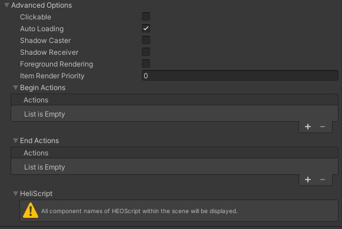

# VKC Item Object

VKC Item Objectは、動的なオブジェクトをシーンに生成するために使用します。 
ここではあらかじめ生成したheoファイルだけではなく、vrm、 [hrm](../WorldOptimization/TextureCompression.md)、 glb形式のファイルも配置できます。

## 設定項目

### 基本設定

| 名称 | 初期値 | 機能 |
| ---- | ---- | ---- |
| Show | true | オブジェクトの表示 / 非表示を切り替えます。 |
| File Mode | | heo, vrm, hrm, glbファイルのいずれかを指定します。 vrmモデルの[テクスチャ圧縮](../WorldOptimization/TextureCompression.md)を行っている場合はhrmに該当のファイルを指定します。 |
| Scene Preview | false | オブジェクトの生成された状態をUnityシーン上でプレビューします。 詳細は下記「プレビュー機能」にて解説します。 |
| Enable Bone | false | アーマチュアによるアニメーションを再生する場合はオンにします。（vrm, hrm, glbのみ） |
| Circle Shadow | false | オブジェクトの足元に丸影を投影するか切り替えます。 |
| Look at Camera | false | カメラ方向に対して常に正面を向くようになります。 |
| Object Mode | None | None、Pose、Motionから任意に選択します。PoseもしくはMotionを選択した場合、追加でhemファイルを指定する必要があります。 |

### Advanced

| 名称 | 初期値 | 機能 |
| ---- | ---- | ---- |
| Clickable | false | オブジェクトがクリックされた際の判定を発生させるか否かを設定します。 |
| Auto Loading | true | [動的ローディング](VKCItemField.md)にて使用します。  デフォルトはtrueで初回ローディング時に読み込まれます。 |
| Shadow Caster | false | [シャドウマッピング](../VketCloudSettings/RenderingSettings.md)が有効になっている際に、本オブジェクトの影を他のオブジェクトに投影するか設定します。 |
| Shadow Receiver | false | [シャドウマッピング](../VketCloudSettings/RenderingSettings.md)が有効になっている際に、他オブジェクトの影を本オブジェクトへと投影するか設定します。 |
| Foreground Rendering | false |最前面描画(深度値を考慮せずに一番手前に描画)を行うか設定します。 |
| Item Render Priority || Itemの描画順序を決定します。 詳細は[RenderingSettings / Priority List](../VketCloudSettings/RenderingSettings.md)をご参照ください。 |
| Begin Actions | | モーション再生時にトリガーする[アクション](../Actions/ActionsOverview.md)を設定できます。 |
| End Actions | | モーション終了時にトリガーする[アクション](../Actions/ActionsOverview.md)を設定できます。 |
| HeliScript | | [VKC Attribute Script](VKCAttributeScript.md)にて設定したHeliScriptの対象となるか否かを設定します。 [VKC Attribute Script](VKCAttributeScript.md)が設定されていない際は本項目の説明が表示されます。|

## Mode - Pose設定項目

| 名称 | 初期値 | 機能 |
| ---- | ---- | ---- |
| .hem | | モーションファイルを設定します。 |
| Scene Preview | false | オブジェクトの生成された状態をUnityシーン上でプレビューします。 詳細は下記「プレビュー機能」にて解説します。 |

## Mode - Motion設定項目

| 名称 | 初期値 | 機能 |
| ---- | ---- | ---- |
| .hem | | モーションファイルを設定します。 |
| Scene Preview | false | オブジェクトの生成された状態をUnityシーン上でプレビューします。 詳細は下記「プレビュー機能」にて解説します。 |
| Loop | false | モーションをループ再生するか設定します。歩きや待機モーションではオンにしてください。|
| Draw Circle Shadow | true | モーション再生時に丸影を描画するかどうか設定します。 |
| Collision Detection | true | モーション再生時に衝突判定をおこなうかどうか設定します。 |
| Actions | false | モーション再生時に実行する[アクション](../Actions/ActionsOverview.md)を設定します。|

## プレビュー機能

Scene Previewを有効にすると、以下のように設定したオブジェクトファイルが生成位置にプレビュー表示されます。

また、Object Modeにて`Pose`もしくは`Motion`を選択すると、モーションのHEMファイルがUnityのAnimationClipに変換されてプレビューができます。

Scene Previewを有効にすると出現するスライダーをドラッグすると、HEOオブジェクトのアクションを調整できます。 
なお、このスライダーはモーションをプレビューするだけで、ビルド時のオブジェクトには反映されません。

!!! note caution
    以前のバージョンにて作成されたheoファイルのプレビューを有効にした際に、該当のモデルが正常に表示されない場合があります。 
    恐れ入りますが、表示不具合が発生した際はheoファイルの再作成をお試しください。
