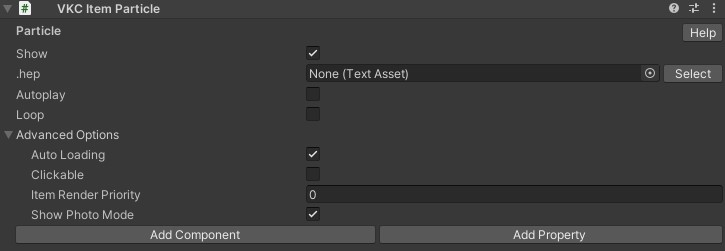

# VKC Item Particle

VKC Item Particle is a component that expands particles based on .hep format files.  

| Label | function |
| ---- | ---- |
| .hep | Specifies the hep file. |
| autoplay | Automatically play particles. |
| loop | Loops particle playback. |

You can output a .hep file with UnityEditor menu > VketCloudSDK > ExportParticle, but it is currently deprecated.  
Please use [Particle Editor](../particleeditor/pe_about_particleeditor.md) to create .hep files instead.