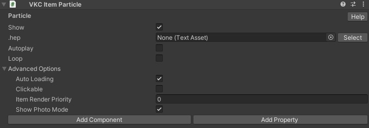

# VKC Item Particle

VKC Item Particleは、.hep形式のファイルを元にパーティクルを展開するコンポーネントです。 

UnityEditorメニュー > Vket Cloud SDK > ExportParticleで.hepファイルを出力することが出来ますが、現在は非推奨です。 
代わりに [パーティクルエディター](../particleeditor/pe_about_particleeditor.md) を使用して.hepファイルの作成を行ってください。

???+ note "このオブジェクトタイプを使用可能なItemクラス"
    - [Equals](../hs/hs_class_item.md#equals)
    - [GetName](../hs/hs_class_item.md#getname)
    - [SetPos](../hs/hs_class_item.md#setpos)
    - [GetPos](../hs/hs_class_item.md#getpos)
    - [Play](../hs/hs_class_item.md#play)
    - [Stop](../hs/hs_class_item.md#stop)
    - [IsPlay](../hs/hs_class_item.md#isplay)
    - [SetShow](../hs/hs_class_item.md#setshow)
    - [IsShow](../hs/hs_class_item.md#isshow)
    - [Load](../hs/hs_class_item.md#load)
    - [Unload](../hs/hs_class_item.md#unload)
    - [IsLoading](../hs/hs_class_item.md#isloading)
    - [IsLoaded](../hs/hs_class_item.md#isloaded)
    - [ReplaceItem](../hs/hs_class_item.md#replacetexture)
    - [SetProperty](../hs/hs_class_item.md#setproperty)
    - [GetProperty](../hs/hs_class_item.md#getproperty)
    - [CallComponentMethod](../hs/hs_class_item.md#callcomponentmethod)
    - [SetOverridesProperty](../hs/hs_class_item.md#setoverridesproperty)
    - [GetOverridesProperty](../hs/hs_class_item.md#getoverridesproperty)

## 設定

|  名称 |  初期値  | 機能 |
| ----   | ---- | ---- |
| .hep | None | hepファイルを指定します。 |
| autoplay | false | パーティクルを自動再生します。 |
| loop | false | パーティクルの再生をループします。 |

### 高度な設定

|  名称 |  初期値  | 機能 |
| ----   | ---- | ---- |
| Auto Loading | true | 有効の場合、本Itemはワールド入場時に自動で読み込まれます。 無効の場合は自動で読み込まれないため、[動的ローディング](VKCItemField.md)を使用するか、HeliScriptで[Load()](../hs/hs_class_item.md#load)を使用して読み込みます。|
| Clickable | false | クリック可能かどうかを変更します |
| Item Render Priority | 0 | Itemの描画順序を決定します。 詳細は[RenderingSettings / Priority List](../VketCloudSettings/RenderingSettings.md)をご参照ください。 |
| Show Photo Mode | true | 写真撮影モードの際、itemを表示するかどうかを変更します |