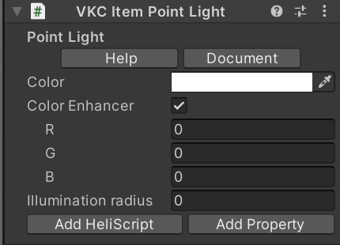

# VKCItemPointLight

## Overview
This component provides Point Light functionality.
`color` determines the light color, and `range` sets the maximum effective range of the point light.

!!! warning "Note"
    The maximum number of point lights in a scene is 4. If more are placed, the excess ones will be ignored (this will not cause a build error).

## Settings

| Name | Default Value | Function |
| :--- | :--- | :--- |
| **Color** | White(0,0,0) | Specified in RGB. Each value is specified between 0 and 1. |
| **Color Enhancer** | false | Determines whether to specify a multiplier to add as a coefficient to the above RGB values. |
| **Illumination radius** | | The range (radius) that the light reaches. |

### Color Enhancer Settings
| Name | Default Value | Function |
| :--- | :--- | :--- |
| **R** | 0 | 0~ (specified as float) Used to emphasize the R value specified in "Color" by 1.0 or more. |
| **G** | 0 | 0~ (specified as float) Used to emphasize the G value specified in "Color" by 1.0 or more. |
| **B** | 0 | 0~ (specified as float) Used to emphasize the B value specified in "Color" by 1.0 or more. |
