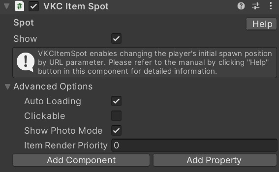
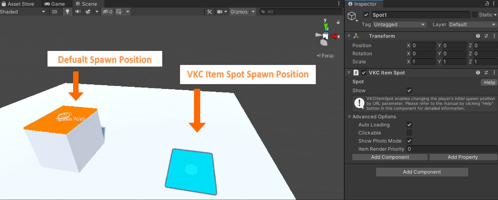

# VKC Item Spot

VKC Item Spot enables changing the player's initial spawn position by URL parameter.

To change the normal initial spawn position, set via the [HEOPlayer](HEOPlayer.md).

## How to use VKC Item Spot

Create a new GameObject, add the VKC Item Spot component and rename the GameObject in a form of `Spot{x}` such as `Spot1`, `Spot2`.

The GameObject Position will be the initial player position when the URL parameter is added.

When accessing the world with the `spaceindex={x}` parameter added in the URL (e.g. `&spaceindex=1`), the player will spawn on the VKC Item Spot position.

Initial spawn position when the spaceindex parameter is not set:

Initial spawn position when the spaceindex parameter is set:

