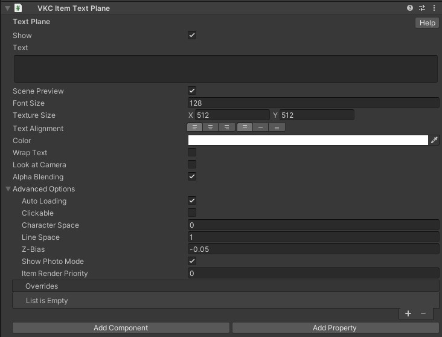

# VKC Item Text Plane

VKC Item Text Plane will display the designated text at the object position attaching this component. 
For example, by Build & Running the world the text will be displayed as below: 

## Settings

| Label | Initial Value | Function |
| ----   | ---- | ---- |
| World Position | Same value as Transform's Position value | Set the position for displaying text |
| World Rotation | Same value as Transform's Rotation value | Set the rotation for displaying text |
| World Scale |  | Same value as Transform's Scale value | Set the scale for displaying text |
| Show | true | Enable this if you want the text to display by default |
| Scene Preview | true | Enable/Disable text preview in the Unity editor's Scenet view.  This setting is a beta feature | 
| Look at Camera | false |  Make the text face towards the camera at all times |
| Alpha Blending | true | Lets you use cutout/transparency |
| Text | blank | Input the text to be displayed |
| Font Size | 128 |  Specify the text size |
| Text Alignment | Left Top | Set the text alignment and centering for display |
| Color | #FFFFFF | Specify the text color |
| Wrap Text | false | Enable/Disable automatic text wrapping |
| Texture Size | X:512 Y:512 | Specify the base resolution for the displayed text texture   **Value needs to be a power of two!** |
| Character Space | 0.0| Set the character space by pixel |
| Line Space | 1.0 | Set the line space by pixel |
| Z-Bias | -0.05 | Higher z value will make the text drawn in front of other objects |
| Overrides | | On Entering the world, the text set in this `text` property will be used instead Text in VKC Item Text Plane. |

!!! note caution
    The Overrides property is currently under progress. 
    Further usage are to be added by future updates.

By enabling preview, the designated text will be shown in the Scene view as below:

!!! note
    The `Billboard` setting in pre-Ver9.3 components has been renamed to `Look at Camera`. 
    If the scene data is migrated from past SDK versions, the `Billboard` setting value will be reflected to `Look at Camera`.