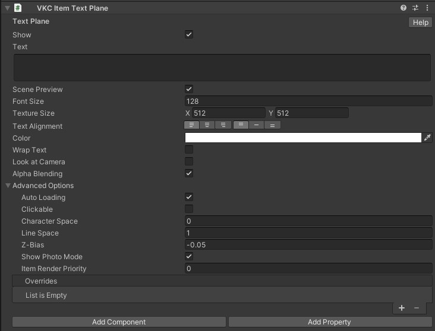

# VKC Item Text Plane

VKC Item Text Planeは、ワールドのビルド時に本コンポーネントがアタッチされたオブジェクトの位置にテキストを表示します。 
ワールドをビルドして実行すると、以下のように表示されます。

???+ note "このオブジェクトタイプを使用可能なItemクラス"
    - [Equals](../hs/hs_class_item.md#equals)
    - [GetName](../hs/hs_class_item.md#getname)
    - [SetPos](../hs/hs_class_item.md#setpos)
    - [GetPos](../hs/hs_class_item.md#getpos)
    - [SetQuaternion](../hs/hs_class_item.md#setquaternion)
    - [GetQuaternion](../hs/hs_class_item.md#getquaternion)
    - [GetScale](../hs/hs_class_item.md#getscale)
    - [SetScale](../hs/hs_class_item.md#setscale)
    - [MovePos](../hs/hs_class_item.md#movepos)
    - [IsMoving](../hs/hs_class_item.md#ismoving)
    - [SetShow](../hs/hs_class_item.md#setshow)
    - [IsShow](../hs/hs_class_item.md#isshow)
    - [Load](../hs/hs_class_item.md#load)
    - [Unload](../hs/hs_class_item.md#unload)
    - [IsLoading](../hs/hs_class_item.md#isloading)
    - [IsLoaded](../hs/hs_class_item.md#isloaded)
    - [ClearTextPlane](../hs/hs_class_item.md#cleartextplane)
    - [WriteTextPlane](../hs/hs_class_item.md#writetextplane)
    - [SetProperty](../hs/hs_class_item.md#setproperty)
    - [SetOverridesProperty](../hs/hs_class_item.md#setoverridesproperty)
    - [GetOverridesProperty](../hs/hs_class_item.md#getoverridesproperty)

## 設定項目

| 名称 | 初期値 | 機能 |
| ----   | ---- | ---- |
| Show | true | ビルド時の初期状態として文字を表示したい場合はオンにします |
| Text | 空欄 | 表示するテキストを入力します |
| Scene Preview | true | UnityのSceneビューにてプレビューするか否かを設定します。  本機能は試験的な機能です | 
| Font Size | 128 | 文字の大きさを指定します |
| Font Weight | 400 | 文字の太さを指定します　|
| Texture Size | X:512 Y:512 | テキスト表示のベースとなるテクスチャサイズを指定します  **※2の累乗である必要があります！** |
| Text Alignment | Left Top | センタリング等、テキストのアライメント(整列)を指定します。 初期状態では左上に整列されます |
| Color | #FFFFFF | 文字の色を指定します |
| Wrap Text | false | 自動改行するか否かを設定します |
| Look at Camera | false | カメラ方向に対して常に正面を向くようになります |
| Alpha Blending | true | 半透明やカットアウトを使用できます |

!!! note caution
    Text項目では、改行をおこないたい場合は”\n”を文字列中に指定します。
    それ以外のすべての正規表現（例えば、タブ "\t"、改行 "\r"、バックスペース "\b"）を入力した場合、ビルドエラーが発生します。

!!! warning "Font Weightは安定版SDK14.4.12でご使用いただけません"
    Font Weightは安定版SDK14.4.12で機能がロールバックのためご使用いただけません。
    SDK14.2.1もしくは14.4.12より新しいバージョンがあれば、そちらをご使用ください。

### 高度な設定

| 名称 | 初期値 | 機能 |
| ----   | ---- | ---- |
| Auto Loading | true | 有効の場合、本Itemはワールド入場時に自動で読み込まれます。 無効の場合は自動で読み込まれないため、[動的ローディング](VKCItemField.md)を使用するか、HeliScriptで[Load()](../hs/hs_class_item.md#load)を使用して読み込みます。|
| Clickable | false | クリック可能かどうかを変更します |
| Character Space | 0.0| 文字の間隔をピクセル単位で指定します |
| Line Space | 1.0 | 行間隔をピクセル単位で指定します |
| Z-Bias | -0.05 | z値が高いと、ほかのオブジェクトよりも手前に表示されます |
| Show Photo Mode | true | 写真撮影モードの際、itemを表示するかどうかを変更します |
| Item Render Priority | 0 | Itemの描画順序を決定します。 詳細は[RenderingSettings / Priority List](../VketCloudSettings/RenderingSettings.md)をご参照ください。 |
| Overrides | | ワールド入場時に`Overrides`にて設定された`Text`を使用して文字列を上書きします |

!!! note caution
    Overrides項目は現在実装中の機能です。 
    本機能については今後のアップデートで使い方が更新される予定です。

preview設定を有効にすると、以下のようにテキストがSceneビューにて表示されます。

!!! note
    Ver9.3以前の`Billboard`設定は`Look at Camera`に名称が変更されました。 
    以前のSDKバージョンからシーンデータを移植した場合、`Billboard`の設定は`Look at Camera`に引き継がれます。