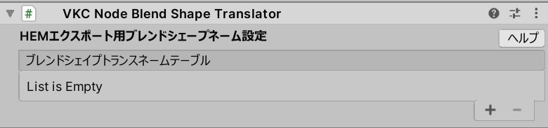
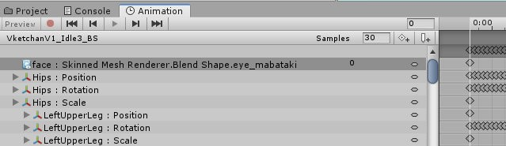
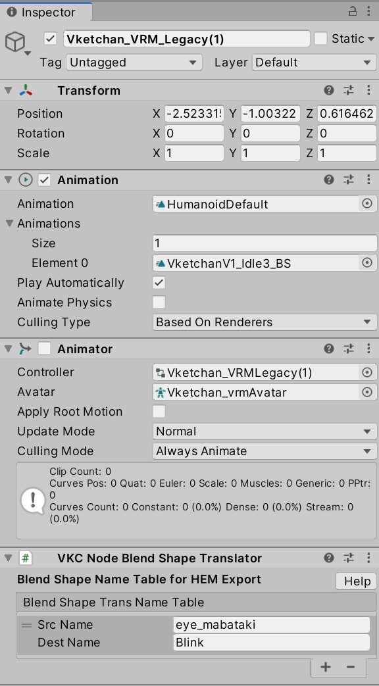
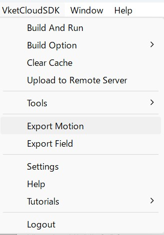

# VKC Node Blend Shape Translator

VKC Node Blend Shape Translator is a component used when exporting HEM character motion.
The exported HEM file can be used to play animations for preset avatars or VKCItemObjects.

After creating the humanoid animation, converting it to Legacy will leave the blend shape names as they are, such as "eye_mabataki," in the original SkinnedMeshRenderer's BlendShapes. If the HEM file is output as is, the blend shape name will be lost in the VRM file and will not be reflected.

Add the VKC Node Blend Shape Translator component to the character, add a new item to Blend Shape Trans Name Table, and set the motion name before and after conversion in SrcName/DestName.

| Label | Function |
| ---- | ---- | 
| Src Name | Motion name before conversion |
| Dest Name | Motion name after conversion |

When the HEM file is exported in this state, the blend shape names will be output with the converted names.

