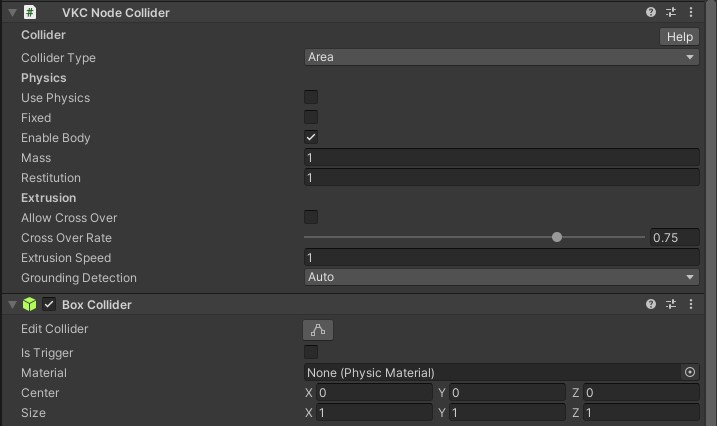

# VKC Node Collider

VKC Node Collider is a component to set what kind of collision detection a collider has on Vket Cloud.

| Label | Function |
| ---- | ---- |
| `Collider type` | Specifies the type of collider. |
| `Collider target` | Specifies the target. |
| `physics` | Enables physics engine for the Box Collider. |
| `Fixed` | Fix the position of the Box Collider. |
| `Enable body` | You can choose whether to enable physics when the object is loaded. |
| `Mass` | Adjust the weight parameter. |
| `Restitution` | Adjust the coefficient of restitution. |
| `Allow Cross Over` | Allows the player to pass through the collider |
| `Cross Over Rate` | Set the rate of distance passing through the collider. Set from zero to one. |
| `Extrusion Speed` | Set the speed of the extrusion when crossing. |
| `Grounding Detection` | Enable grounding detection. |

## Collider type

| Type | Function |
| ---- | ---- |
| `Collider` | Plays the role of a collider. |
| `Clickable` | Allows players to click. |
| `Area` | A collider that can be passed through. By combining with [VKC Item Area Collider](./VKCItemAreaCollider.md), you can set any action when the player get inside the area. |
| `Occlusion` | Enable occlusion on contact.   For instructions, please refer to [Occlusion Culling](../WorldOptimization/OcclusionCulling.md).  |
| `Reflection Probe` | Enable reflection probes on touch. |
| `in View` | Handled when you want to judge whether or not the object entered the field of view |

!!! note caution
    If collider type is set to other than `Collider` (i.e. Clickable, Area, Occlusion, Reflection Probe, inView), the player will not collide with the collider.

## Collider target

| Target | Function |
| ---- | ---- |
| `All` | Does not restrict the collision detection. |
| `Avatar Only` | Collision detection is enabled only for avatars. |
| `Self Player Only` | Collision detection is enabled only for the player themselves. |

## About collision / area range detection by collider

The collision / area range detection by collider will be done by obtaining the player's lower body position as the orange circle shown below. 
Collision visualization can be toggled by enabling the [debug mode](../WorldEditingTips/DebugMode.md#f3-display-collision) on [VketCloudSettings / BasicSettings](../VketCloudSettings/BasicSettings.md) and pressing F3.

## Grounding Detection
| Type | Function |
| ---- | ---- |
| `Auto` |  |
| `Enable` |  |
| `Disable` | |
