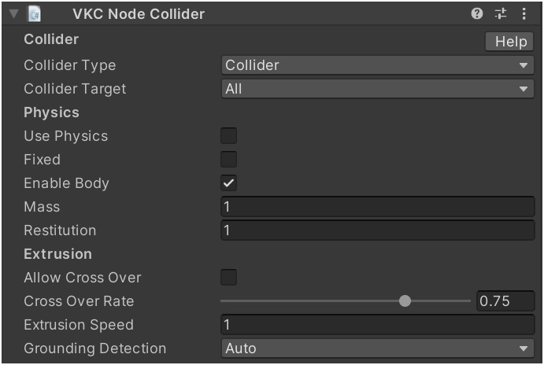

# VKC Node Collider

VKC Node Collider is a component to set what kind of collision detection a collider has on Vket Cloud.

| Label | Function |
| ---- | ---- |
| `Collider type` | Specifies the type of collider. |
| `Collider target` | Specifies the target. |
| `physics` | Enables physics engine for the Box Collider. |
| `Fixed` | Fix the position of the Box Collider. |
| `Enable body` | You can choose whether to enable physics when the object is loaded. |
| `Mass` | Adjust the weight parameter. |
| `Restitution` | Adjust the coefficient of restitution. |
| `Allow Cross Over` | Specifies whether to allow penetration for the collider. |
| `Cross Over Rate` | The ratio of how much penetration is allowed. The closer to 0.0, the larger the range of penetration. |
| `Extrusion Speed` | Set the extrusion speed when the penetration ratio exceeds the allowable penetration ratio. |
| `Grounding Detection` | Set the grounding process. Grounding detection is the process of determining whether the top of the collider is on the ground and the process of riding on it if it is on the ground. |

!!! note "About Extrusion"
    The function of VKC Node Collider added in SDK13.0 that allows you to adjust the behavior of the extrusion process of collision detection.
    For example, you can allow a certain amount of penetration through a gap (collider) that cannot be passed through in the collision detection, or prevent small objects from interfering with movement.

## Collider type

| Type | Function |
| ---- | ---- |
| `Collider` | Plays the role of a collider. |
| `Clickable` | Allows players to click. |
| `Area` | A collider that can be passed through. By combining with [VKC Item Area Collider](./VKCItemAreaCollider.md), you can set any action when the player get inside the area. |
| `Occlusion` | Enable occlusion on contact.   For instructions, please refer to [Occlusion Culling](../WorldOptimization/OcclusionCulling.md).  |
| `Reflection Probe` | Enable reflection probes on touch. |
| `in View` | Handled when you want to judge whether or not the object entered the field of view |

!!! note caution
    If collider type is set to other than `Collider` (i.e. Clickable, Area, Occlusion, Reflection Probe, inView), the player will not collide with the collider.

## Collider target

| Target | Function |
| ---- | ---- |
| `All` | Does not restrict the collision detection. |
| `Avatar Only` | Collision detection is enabled only for avatars. |
| `Self Player Only` | Collision detection is enabled only for the player themselves. |

## Grounding Detection

| Label | Function |
| ---- | ---- |
| `Auto` | Automatically detects based on the collider size. Small sizes are disabled, and medium and large sizes are enabled. |
| `Enable` | Grounding detection enabled |
| `Disable` | Grounding detection disabled |

## About collision / area range detection by collider

The collision / area range detection by collider will be done by obtaining the player's lower body position as the orange circle shown below. 
Collision visualization can be toggled by enabling the [debug mode](../WorldEditingTips/DebugMode.md#f3-display-collision) on [VketCloudSettings / BasicSettings](../VketCloudSettings/BasicSettings.md) and pressing F3.

