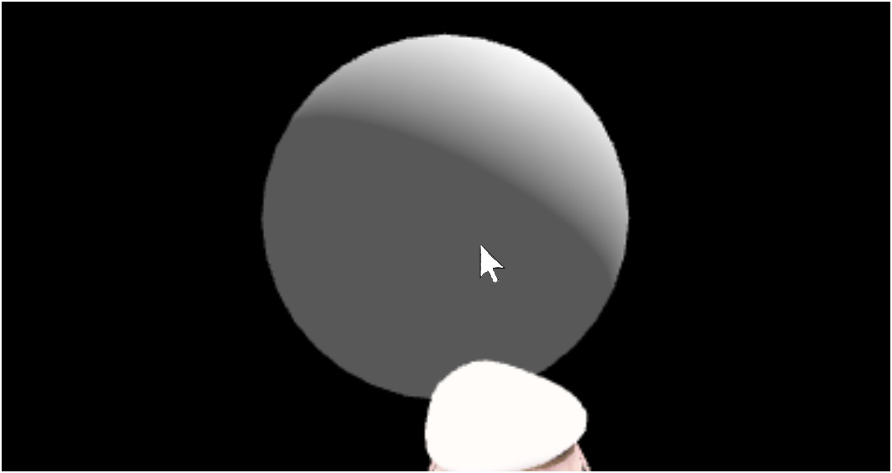
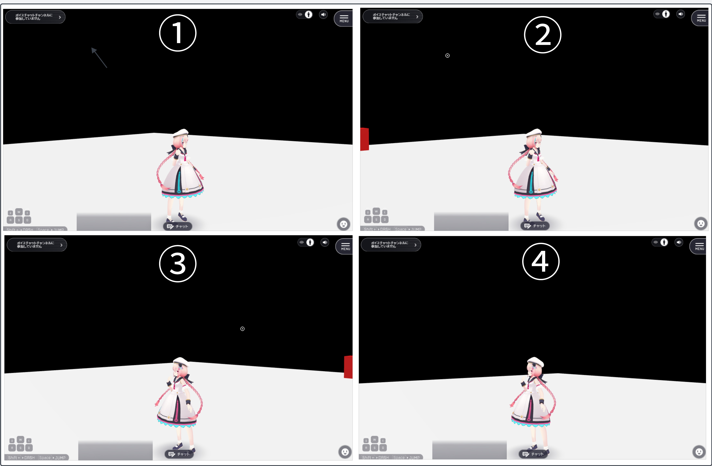

# VKC Node Collider
This is a basic component for colliders that adds collision detection to nodes and can be used in combination with other collider components.  
A notable feature is that its properties change significantly based on the collider type setting described below.

!!! note "About this guide"
    This guide explains the basic usage and settings of the VKC Node Collider. For information about other collider components and practical examples, please refer to [How to Use Colliders/Tips](../../WorldMakingGuide/Collider.md).

## Property List

| Category | Label | Function |
| ---- | ---- | ---- |
| Collider | Collider Type | Specifies the type of collider. Details are described below. |
| | Collider Target | Specifies the target. Details are described below. |
| Physics | Use Physics | Enables physics calculations for the Box Collider. |
| | Fixed | Allows you to fix the position of the Box Collider. |
| | Enable Body | Allows you to choose whether to enable physics when the node is loaded. |
| | Mass | Adjusts the mass parameter. |
| | Restitution | Adjusts the restitution (bounciness) parameter. |
| Extrusion | Allow Cross Over | Specifies whether to allow penetration into the collider. |
| | Cross Over Rate | The ratio of penetration allowed. Values closer to 0.0 allow for greater penetration. |
| | Extrusion Speed | Sets the speed at which objects are pushed out when they exceed the allowed penetration ratio. |  
| | Grounding Detection | Sets ground detection. Ground detection determines whether the upper surface of a collider is ground, and if so, allows objects to stand on it. Details are described below. |

!!! tip "Extrusion adjustment is now available"
    In SDK 13.0 and later, the behavior of collision extrusion can now be adjusted.
    For example, you can allow some penetration to pass through gaps (colliders) that would otherwise be impassable due to collision detection, or prevent small nodes from getting in the way when moving.

### Details of Collider Types
The collider type specified in the properties has the following characteristics:

#### 1. **Collider**
Adds collision detection to nodes, making it possible to detect contact with other nodes or players that also have collision detection.
It also creates physical collisions, so this type is used for walls that prevent player movement and floors for walking. 
 
The player's collider collides with the wall's collider, preventing the player from moving forward.

!!! warning "Please use in combination with the Box Collider component"
    Collision detection will not be added when combined with Unity components other than Box Collider, such as Sphere Collider.

!!! note "Players will pass through if set to any other type"
    Nodes with types other than `Collider` can be moved through by players without stopping when touched.

#### 2. **Clickable**
Making it a clickable target enables detection of mouse cursor clicks.
Use cases include interactions such as picking up items, opening doors, or displaying UI menus when clicked.

#### 3. **Area**
When you attach the VKCItemAreaCollider component to a GameObject, this type of VKCNodeCollider is also automatically added. 
For more details, please refer to [VKC Item Area Collider](./VKCItemAreaCollider.md).

#### 4. **Occlusion**
By adding this type of collider to nodes such as walls, rendering of nodes behind that node will be omitted. 
For more details, please refer to [Occlusion Culling](../WorldOptimization/OcclusionCulling.md).

#### 5. **Reflection Probe**

!!! warning
    Please avoid selecting this type manually. It is currently selectable in the inspector, but it is scheduled to be hidden in future SDK updates.

#### 6. **In View**
Fires when a node enters or exits the field of view.
As a use case, for example, you can create enemy characters that don't approach you only when they are in your field of view. 
 
①The red cube has not yet entered the field of view, ②The red cube has entered the field of view, so it fires. ③It doesn't fire because the cube is still in the field of view. ④It fires because the red cube has completely left the field of view.

!!! warning "HeliScript must be used"
    You need to use the HeliScript callback function for detection.
    For more details, please refer to [Callbacks - Field of View Collider Detection](../hs/hs_component.md).

### Details of Collider Targets

| Label | Function |
| ---- | ---- |
| All | Collision targets are not restricted, collides with all colliders. |
| Avatar Only | Collision targets are restricted to avatars only. Collides only with avatars, not with cameras, etc. |
| Self Player Only | Collision targets are restricted to only the avatar controlled by yourself. Does not collide with avatars controlled by other players.  |

!!! warning "caution"
    The collider target setting functions only when the collider type is set to `Collider`.

### Details of Ground Detection

| Label | Function |
| ---- | ---- |
| Auto | Automatically determined by collider size. Disabled for small sizes, enabled for medium and large sizes. |
| Enable | Ground detection enabled |
| Disable | Ground detection disabled |