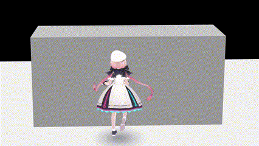
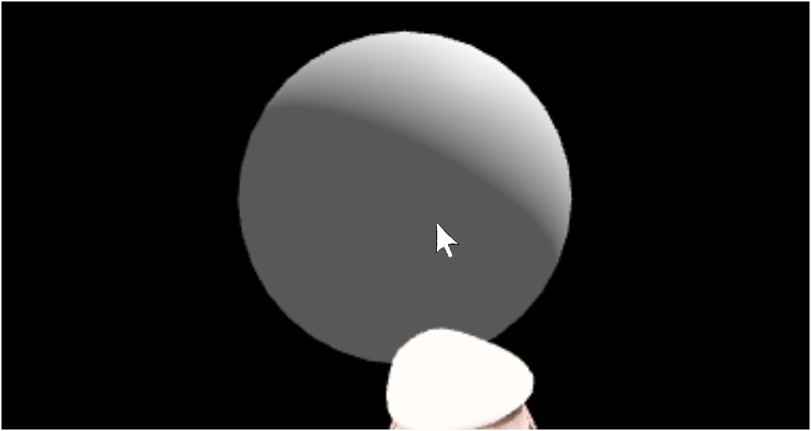
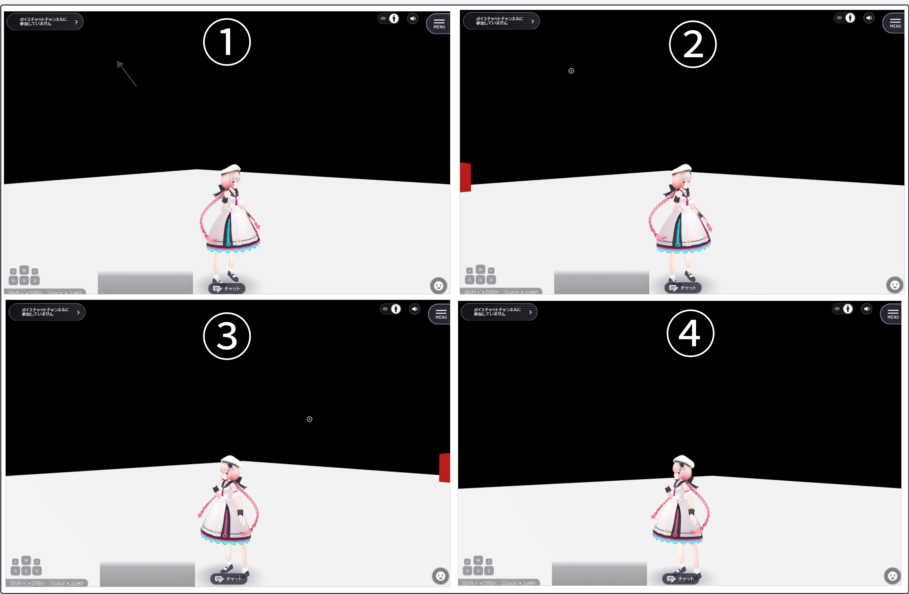

# VKC Node Collider
ノードに衝突判定を付与したり、その他のコライダー用コンポーネントと組み合わせて使用するコライダー用の基本コンポーネントです。  
また、後述するプロパティのコライダータイプの設定によって、性質が大きく変化するのも特徴です。

!!! note "このガイドについて"
    このガイドではVKC Node Colliderの基本的な使い方と設定について説明します。その他のコライダー用コンポーネントや実践例については[コライダーの使い方/Tips](../../WorldMakingGuide/Collider.md)を参照してください。

## プロパティ一覧

| Category | Label | 名称 | 機能 |
| ---- | ---- | ---- | ---- |
| Collider | Collider Type | `コライダータイプ` | コライダーのタイプを指定します。 詳細を後述しています。|
| | Collider Target | `コライダーターゲット` | ターゲットを指定します。 詳細を後述しています。|
| Physics | Use Physics | `物理演算を適用` | Box Colliderに対して物理演算を可能にします。 |
| | Fixed | `位置の固定` | Box Colliderの位置を固定することができます。 |
| | Enable Body | `ロード時に物理演算を有効にする` | ノードが読み込まれた際に物理演算を有効にするかどうかを選択できます。 |
| | Mass | `重さ` | 重さパラメータを調整します。 |
| | Restitution | `反発係数` | 反発係数のパラメータを調整します。 |
| Extrusion | Allow Cross Over | `埋まりを許容` | コライダーに対する埋まりを許容するかどうか指定します。 |
| | Cross Over Rate | `埋まり比率` | どの程度埋まりを許容するかの割合。0.0に近いほど埋まる範囲が大きくなります。 |
| | Extrusion Speed | `押し出しスピード` | 許容する埋まりの比率を超えた際の押し出しスピードを設定します。|  
| | Grounding Detection | `接地処理` | 接地処理の設定します。接地処理とはコライダーの上面が地面かどうかを判定し、地面であればその上に乗る処理のことです。 詳細を後述しています。|

!!! tip "Extrusionの調整が可能になりました"
    SDK13.0以降で衝突判定の押し出し処理の挙動が調整できるようになりました。
    例えば、衝突判定上は通れない隙間(コライダー)に対して、ある程度埋まることを許容して通れるようにしたり、移動するのに小さいノードが邪魔になるのを防ぐことができます。

### コライダータイプの詳細
プロパティ項目のコライダータイプの指定によって、下記の性質を持ちます。

#### 1. **Collider/ コライダー**
ノードに衝突判定を付与し、同じく衝突判定を持つ他のノードやアバターとの接触が検知可能になります。
また、物理的な衝突も生まれるため、アバターの移動を防ぐ壁や、歩くための床にも、このタイプが用いられます。 
 
下記では壁が持つコライダーとアバターが衝突することで、アバターは前進できないでいます。

!!! warning "Box Colliderコンポーネントと組み合わせで使用してください"
    Sphere ColliderなどBox Collider以外のUnityコンポーネントと組み合わせても衝突判定が付与されません。

!!! note "これ以外のタイプに設定するとアバターはすり抜ける"
    `Collider`以外のタイプを持つノードは、アバターが触れても止まることなく移動できます。

#### 2. **Clickable/ クリック対象**
クリック対象とすることで、マウスカーソルでのクリック検知が可能になります。
ユースケースとしては、例えばクリックするとアイテムを拾う、ドアを開ける、UIメニューを表示するなどのインタラクションに使用できます。

#### 3. **Areae/ エリア**
VKCItemAreaColliderコンポーネントをGameObjectアタッチすると、このタイプのVKCNodeColliderも自動で追加されます。 
詳しくは[VKC Item Area Collider](./VKCItemAreaCollider.md)をご参照ください。

#### 4. **Occlusione/ オクルージョン**
壁などのノードにこのタイプのコライダーを付与することで、そのノードの奥にあるノードの描画が省略されるようになります。 
詳しくは[オクルージョンカリング](../WorldOptimization/OcclusionCulling.md)をご参照ください。

#### 5. **Reflection Probee/ リフレクションプローブ**

!!! warning
    このタイプを手動で選択することは避けてください。現在インスペクター上で選択可能ですが、次回以降のSDKアップデートで非表示になる予定です。

#### 6. **In View/ 描画判定**
ノードが視野内に入った場合または視野外に出た場合に発火します。
ユースケースとして、例えば視野内にいるときだけ近寄ってこない敵キャラクターを作ることができます。 
 
①まだ赤いキューブが視野内に入っていません。②赤いキューブが視野内に入ったため発火します。③まだ視野内にキューブが残っているため発火しません。④赤いキューブが完全に視野外に出たため発火します。

!!! warning "HeliScriptを使用する必要があります"
    判定検知のためにはHeliScriptのコールバック関数を使用する必要があります。
    詳しくは[コールバック - 視野内コライダー判定](../hs/hs_component.md)をご参照ください。

### コライダーターゲットの詳細

| Label | 名称 | 機能 |
| ---- | ---- | ---- |
| All | `全て` | 衝突対象は制限されず、全てのコライダーに衝突します |
| Avatar Only | `アバターのみ` | 衝突対象はアバターのみに制限されます。アバターのみに衝突し、カメラなどには衝突しません。 |
| Self Player Only | `プレーヤー自身のみ` | 衝突対象は自身が操作するアバターのみに制限されます。他プレイヤーが操作するアバターには衝突しません。|

!!! warning "caution"
    コライダータイプが`コライダー`の場合のみ、コライダーターゲットの設定が機能します。

### 接地処理の詳細

| Label | 名称 | 機能 |
| ---- | ---- | ---- |
| Auto | `自動` | コライダーサイズで自動判定します。小サイズは無効、大中サイズは有効です。 |
| Enable | `有効` | 接地処理有効 |
| Disable | `無効` | 接地処理無効 |
