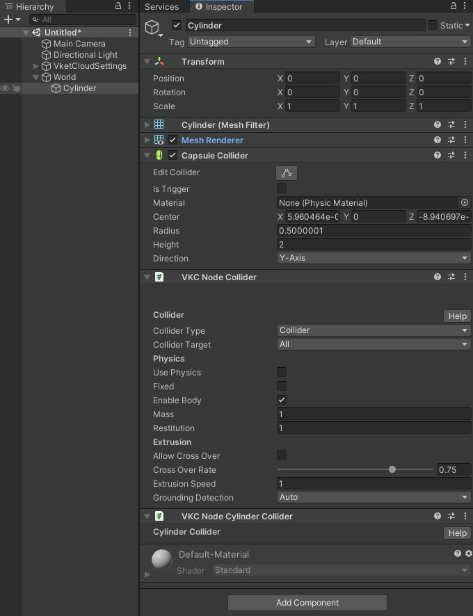

# VKC Node Cylinder Collider

VKC Node Cylinder Collider will generate cylinder collider based on CapsuleCollider of the object by attaching with the VKC Node Collider.

Normally in Unity there is no cylinder collider, and it is substituted by a capsule collider, but in VketCloud, as shown in the image below, by attaching an additional "VKC Node Cylinder Collider" to an object with a "Capsule Collider", you can use it as a cylinder collider exclusively in the VketCloud physics engine.

!!! note "Notes"
    Due to the implementation of collision detection in the physics engine, capsule colliders and cylinder colliders, and cylinder colliders and cylinder colliders do not collide. 
    When using a cylinder collider, thin colliders like Plane may penetrate, so you need to use a box for the ground.

!!!note warning
    Capsule colliders are only supported for area collider purposes.
    Therefore, when VKC Node Cylinder Collider is attached to an object with Mesh Renderer and Capsule Collider, the collider will not function during build and run.

## How to Use

1. This component is intended to use on an object with Unity Mesh Renderer / Capsule Collider components. 
To use, select the object and add a new VKC Node Cylinder Collider component in the Inspector / Add Component.

    

1. When setting a VKC Node Cylinder Collider component, [VKC Node Collider](./VKCNodeCollider.md) will be automatically attached. This component is essential for VKC Node Cylinder Collider and cannot be removed.

    

1. Build and Run world to see the collider generated according to the Capsule Collider.
