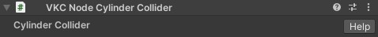

# VKC Node Cylinder Collider

VKC Node Cylinder ColliderはCapsuleColliderが付与されているオブジェクトに対してVKC Node Colliderと共にアタッチすることで、円柱状のコライダーを設定できるコンポーネントです。

通常Unityではシリンダーコライダーは無くカプセルコライダーで代用されますが、Vket Cloudでは『Capsule Collider』を持っているオブジェクトに追加でVKC Node Cylinder Colliderをアタッチすることで、Vket Cloudの物理エンジンにおいてシリンダーコライダーとして使用することができます。

!!! note "注意点"
    - 物理エンジンの衝突判定の実装の都合上、カプセルコライダーとシリンダーコライダー・シリンダーコライダーとシリンダーコライダーは衝突しません。 
    - シリンダーコライダーを使用する場合、Planeの様な薄いコライダーだと貫通してしまうことがあるので地面にボックスを使用する必要があります。 

## 設定手順

1. 本コンポーネントはUnityのMesh Renderer及びCapsule Colliderが付いているオブジェクトが対象です。 
Mesh Colliderを設定したいオブジェクトに対して、Inspector / Add ComponentにてVKC Node Cylinder Colliderを選択してコンポーネントをアタッチします。

    

1. このとき、VKC Node Cylinder Colliderコンポーネントと同時に[VKC Node Collider](./VKCNodeCollider.md)がアタッチされます。[VKC Node Collider](./VKCNodeCollider.md)はVKC Node Cylinder Colliderにとって必須となるコンポーネントのため、削除はできません。

    

1. この状態でビルドすると、Capsule Colliderを基にCylinder Colliderが生成されます。
