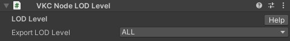

# VKC Node LOD Level
VKC Node LOD Levelは、LOD Groupが設定されたアセットを分解することなく、heoとして書き出すメッシュをスイッチできる機能です。
例えば、LOD0が設定された場合、LOD GroupのLOD 0にセットされたオブジェクトだけが出力されます。

書き出し対象にするLODレベルのオプション

| オプション |
| ---- |
| LOD0 |
| LOD1 |
| LOD2 |
| LOD3 |
| LOD4 |
| LOD5 |
| LOD6 |
| LOD7 |
| 全て |
| 無し |

!!! note caution
    - デフォルトは「全て」に設定されております。
    - VketCloud上でLOD切り替えができるわけではありません。