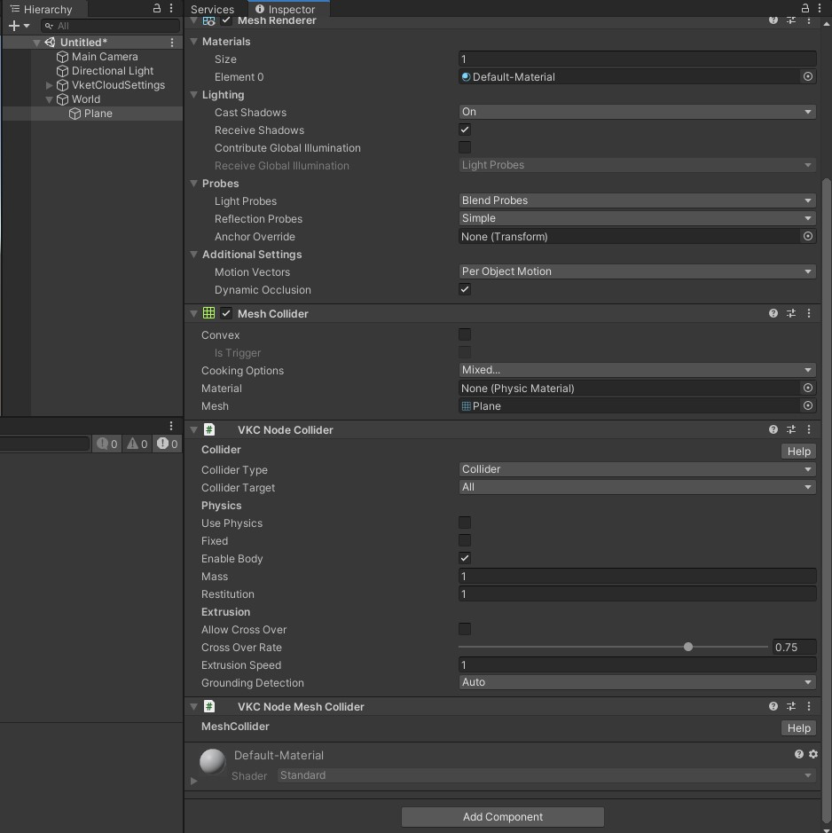

# VKC Node Mesh Collider

VKC Node Mesh Collider will generate a collider on build based on the 3D model's mesh information / Mesh Collider.  

## How to Use

1. This component is intended to use on an object with Unity Mesh Renderer / Mesh Collider components. To use, select the object and add a new VKC Node Mesh Collider component in the Inspector / Add Component.

    

2. When setting a VKC Node Mesh Collider component, [VKC Node Collider](./VKCNodeCollider.md) will be automatically attached. This component is essential for VKC Node Mesh Collider and cannot be removed.

    

3. Build and Run world to see the collider generated according to the 3D model's mesh.

## Notes

!!! bug "Player floating when world only has Mesh Renderer / Mesh Collider objects"
    On SDK Ver12.3, there is an issue occurring when the world has objects only having Mesh Renderer, Mesh Collider, VKC Node Mesh Collider, [VKC Node Collider](./VKCNodeCollider.md) components attached, causing the player to float when enter the world. 
    This issue is scheduled to be fixed on the next SDK release. 
    Also, this issue can be avoided by adding at least a single Cube with Box Collider attached.

!!! note "HEOMeshCollider feature changes on Ver12.3"
    On SDK versions earlier than Ver12.3, the object's mesh and collider had to be separated as the image below to enable mesh colliders for Vket Cloud worlds, which is no longer needed on Ver12.3 and later versions. 
    Also, [VKC Node Collider](./VKCNodeCollider.md) component is now considered as essential, which will be automatically attached to the object when adding HEOMeshCollider component.

