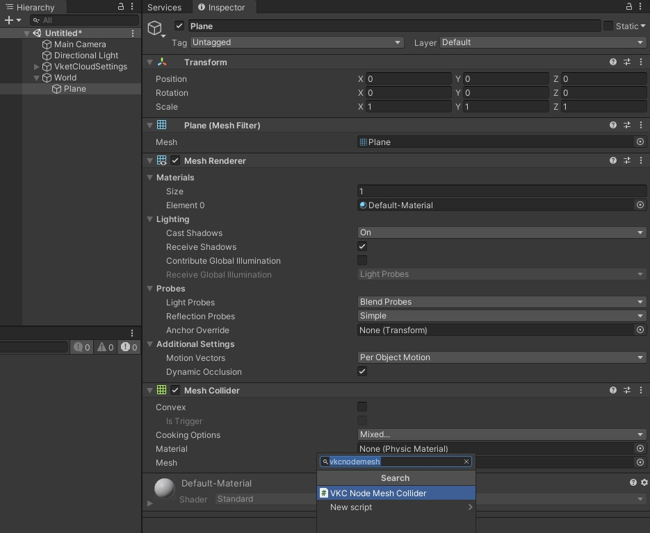

# VKC Node Mesh Collider

VKC Node Mesh Colliderはワールドのビルド時に3Dモデルのメッシュ情報 / Mesh Colliderからそのメッシュにもとづくコライダーを生成するコンポーネントです。

## 設定手順

1. 本コンポーネントはUnityのMesh Renderer及びMesh Colliderが付いているオブジェクトが対象です。 Mesh Colliderを設定したいオブジェクトに対して、Inspector / Add ComponentにてVKC Node Mesh Colliderを選択してコンポーネントをアタッチします。

    

2. このとき、VKC Node Mesh Colliderコンポーネントと同時に[VKC Node Collider](./VKCNodeCollider.md)がアタッチされます。[VKC Node Collider](./VKCNodeCollider.md)はVKC Node Mesh Colliderにとって必須となるコンポーネントのため、削除はできません。

    

3. この状態でビルドすると、3Dモデルのメッシュを基にコライダーが生成されます。

## 備考

!!! bug "ワールドにMesh Renderer / Mesh Colliderのみ存在する際のプレイヤー浮遊について"
    SDK Ver12.3において、ワールドにMesh Renderer, Mesh Collider, VKC Node Mesh Collider, [VKC Node Collider](./VKCNodeCollider.md)が付いたオブジェクトのみ存在する際、ワールド入場時にプレイヤーが空中に浮遊する不具合が確認されています。 
    本不具合は次回のSDKリリースにて修正される予定です。 
    なお、本不具合はBox ColliderがアタッチされたCubeなどをワールドに最低１つ配置することで回避が可能です。

!!! note "Ver12.3でのVKC Node Mesh Collider仕様変更について"
    Vket Cloudのワールドにてメッシュコライダーを使用するために、Ver12.3以前では以下の画像のようにメッシュ部分とコライダーを分ける必要がありましたが、Ver12.3以降では分割が不要になりました。 
    また、[VKC Node Collider](./VKCNodeCollider.md)コンポーネントが必須となり、VKC Node Mesh Collider設定時に自動でアタッチされるように変更されました。

