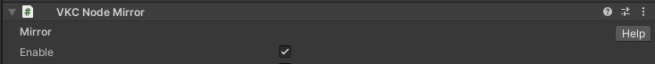
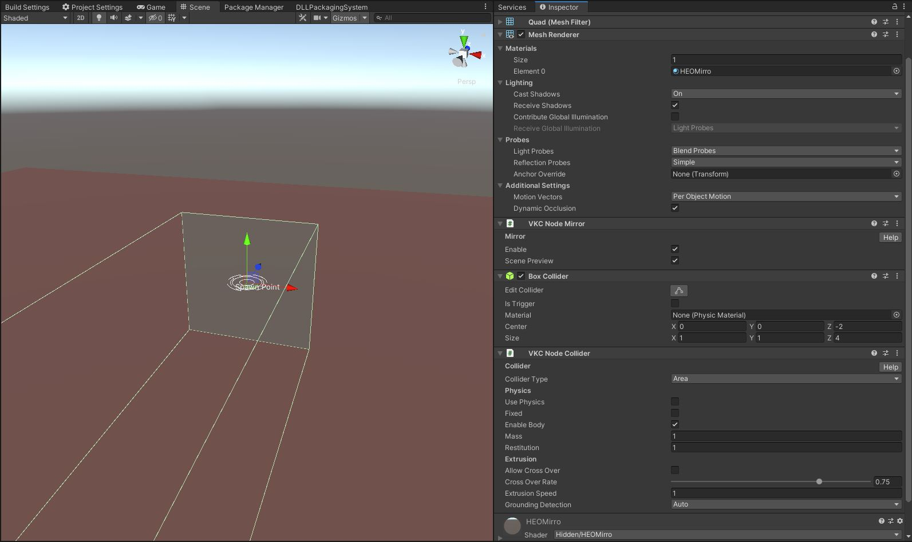

# VKC Node Mirror

VKC Node Mirror is placed with a Quad to implement a pseudo-mirror.

## How to Use

### TLDR

1.Prepare a Quad to be used as a mirror

2.Create Texture and Material

3.Attach VKC Node Mirror to the Quad

### Implementation

1\. Prepare a Quad to be used as a mirror

Create a Quad by selecting Create > 3D Object. 
As VKC Node Mirror is categorized as a Node, the Quad must be a child object of the object with [VKC Item Field](VKCItemField.md) attached.

2\. Create Texture

Create a Texture which width/height is formatted as the power of 2. 
For example, a square 256*256 texture is used here. Note that the texture does not have to be a square.

3\. Attach VKC Node Mirror to the Quad

Attach VKC Node Mirror to the Quad. Make sure to select the `Enable`. Also, turn off the `Scene Preview` .

4\. Attach Texture

By building world at this moment, the object will be a Mirror.

## Tips

### Enabling Mirror while the player is in the designated area

By attaching a Box Collider and [VKC Node Collider](VKCNodeCollider.md), the mirror will be enabled only when the player is in the designated area. Set the [VKC Node Collider](VKCNodeCollider.md)'s collider type to Area, and Collider Target to None. 
If the Box Collider is not attached the mirror will be enabled regardless of player position.

### Changing Material Colors

By using color changeable shaders such as standard, the color tone on the mirror's image will change.

### Using the same material of VKC Node Mirror's object on other objects

Unlike video players, the same material on a different object will not display the mirror image, as only the object with VKC Node Mirror will be a mirror.

### Placing Multiple Mirrors

The object with VKC Node Mirror attached will not be displayed in another VKC Node Mirror?

Therefore, if two or more mirrors are faced, each image will not be displayed on the other, and will show the scenery behind the mirror.

Example: Placing 8 Quads with VKC Node Mirror, each rotated 45°

!!! caution "Performance when placing Mirrors"
    If multiple mirrors are placed with video playing in the mirror's vicinity, it may result to poorer performance on smartphones.
    Please consider the positions when placing mirrors.

!!! warning "Issues in 14.x"
    We have confirmed an issue where a Quad with a Material set to Standard or Autodesk Interactive does not function as a mirror when its Rotation is set to (0.0, 180.0, 0.0).
    A fix is planned, but as a workaround, please switch to Unlit/Texture if this issue occurs.
