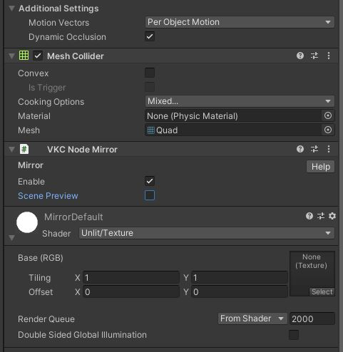

# VKC Node Mirror

HEOMirrorはQuadを使用して鏡のような挙動を再現するために設置します。

## 使い方

### 手順

1.鏡にしたいQuadを用意する

2.Textureを用意し、マテリアルの作成

3.鏡にしたいQuadにVKC Node Mirrorをアタッチ

### 実装方法

1\. 鏡にしたいQuadを用意する

Create > 3D ObjectからQuadを作成します。 
VKC Node Mirrorはノードに分類されるので、Quadは[VKC Item Field](HEOField.md)がアタッチされたオブジェクトの子オブジェクトである必要があります。

2\. Textureを用意し、マテリアルの作成

縦横サイズが2のべき乗のTextureを用意します。 
今回は、1024×1024の画像を使用しています。正方形である必要はありません。

Textureを用意したら、新しいマテリアルを作ります。

Shaderは画像を入れることが出来たらUnlit/Textureでなくても動作します。

3\. 鏡にしたいQuadにVKC Node Mirrorをアタッチ

QuadにHEOMirrorをアタッチします。Enable Mirrorはチェックを入れたままにします。

この状態でビルドすることで、該当のオブジェクトがMirrorになります。

## その他Tips

### エリア内にプレイヤーがいるときだけ鏡を有効にする

Box Colliderと[VKC Node Collider](HEOCollider.md)をアタッチすることで、プレイヤーがコライダー内にいるときだけ鏡描画処理を行うように制御できます。このとき、VKC Node ColliderのCollider TypeをAreaに、Collider TargetをNoneに設定してください。 
Box Colliderをアタッチしない場合、鏡描画処理はプレイヤーの位置に依らず常に行われます。

### マテリアルの色変更について

Standardシェーダーなど、色を付けることができるシェーダーを使うことで、鏡像の色合いを変更することができます。

### HEOMirrorをアタッチしたオブジェクトと同じマテリアルを別オブジェクトに用いた場合

ビデオ再生と異なり、マテリアルに鏡像を映すのではなく、VKC Node Mirrorがアタッチされたもののみが鏡になります。

したがって、同じマテリアルを入れたからといって別オブジェクトで鏡像を確認できるといったことはありません。

### 合わせ鏡について

VKC Node MirrorをアタッチしたオブジェクトはVKC Node Mirrorに映りこまない特徴があります。

したがって、合わせ鏡をした場合、それぞれの鏡像は鏡に映りこまず、鏡の奥にある景色が映りこみます。

例：45°ずつ回転させ8枚のVKC Node MirrorをアタッチしたQuadを作成した場合

!!! caution "Mirrorを設置した際の負荷について"
    スマートフォンにて鏡を多重に設置する・鏡の視界内で動画の再生を始めるなどを行うと、動作が不安定になる可能性があります。
    鏡の設置の際は負荷についてご留意ください。
