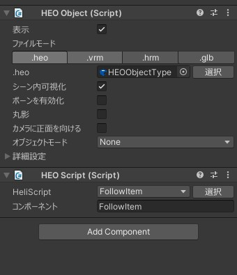

# VKC Node Reflection Probe Type


| Label | Function |
| ----- | -------- |
| Type  | Can change the state of the ReflectionProbe dynamically and statically |

## Example Implementation

1. **Create an Object Including VKCNodeReflectionProbeType**

Create a game object that contains the `VKCNodeReflectionProbeType` component.


2. **Export to a .heo File**

Export the object to a heo file by selecting **VketCloudSDK > Export Field**.


3. **Attach the Exported heo File**

Attach the created heo file to a `VKCItem Object` and then attach the `Follow Item.hs` file using the following VKC Attribute Script.



!!! warning "Note"
    The `VKCNodeReflectionProbeDType` is set when exporting as an HEO, so it is not attached to the game object itself.


```csharp
component FollowItem
{
    Utility m_Utility;
    Item m_item;
    Player m_player;

    bool m_flag;

    public FollowItem()
    {
        m_Utility = new Utility();
        m_item = hsItemGetSelf();
    }

    public void OnClickNode(int nodeIndex)
    {
        m_player = hsPlayerGet();

        string clickedNodeName = m_item.GetNodeNameByIndex(nodeIndex);
        
        if(! m_flag)
        {
            m_flag = true;
        }
        else
        {
            m_flag = false;
        }
    }

    public void Update()
    {
        if(m_flag)
        {
            Vector3 pos = m_player.GetPos();
            Vector3 offset = makeVector3(0f, 2f, 0f);
            m_item.SetPos(m_Utility.AddVector(pos, offset));
        }
    }
}
```

4. **Build and Run**

When you build and run the project, the reflection dynamically follows the skybox. Clicking the spheres positioned in front of the two skyboxes will switch between them, resulting in the behavior shown in the images.


