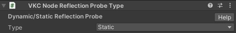

# VKC Node Reflection Probe Type


| Label | function |
| ---- | ---- |
| Type | ReflectionProbeの状態を動的・静的に変更できる |

## 実装例

1. VKCNodeReflectionProbeTypeを含むオブジェクトを作成する


2. heoファイルにエクスポートする(VketCloudSDK > Export Field)


3. 作成したheoファイルをVKCItem Objectにアタッチし、以下VKC Attribute ScriptでFollow Item.hsファイルをアタッチする。


!!! warning "注意点"
    VKCNodeReflectionProbeDTypeは、HEOとして書き出すときに設定するので、このゲームオブジェクト自体にはアタッチされていません。

```csharp
component FollowItem
{
    Utility m_Utility;
    Item m_item;
    Player m_player;

    bool m_flag;

    public FollowItem()
    {
        m_Utility = new Utility();
        m_item = hsItemGetSelf();
    }

    public void OnClickNode(int nodeIndex)
    {
        m_player = hsPlayerGet();

        string clickedNodeName = m_item.GetNodeNameByIndex(nodeIndex);
       
        if(! m_flag)
        {
            m_flag = true;
        }
        else
        {
            m_flag = false;
        }
    }

    public void Update()
    {
        if(m_flag)
        {
            Vector3 pos = m_player.GetPos();
            Vector3 offset = makeVector3(0f ,2f, 0f);
            m_item.SetPos(m_Utility.AddVector(pos, offset));
        }
    }
}
```

4. ビルドランすると以下のような状態で、動的にリフレクションが、天球に沿ったものになります。


ふたつの天球の前にあるSphereをクリックして、天球を行き来すると、画像のような挙動になります。
