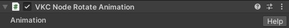
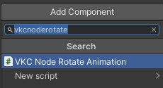
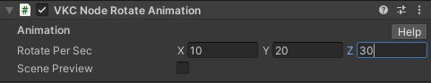
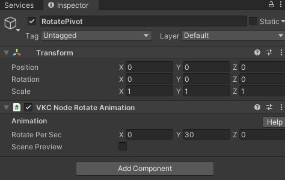

# VKC Node Rotate Animation

`VKC Node Rotate Animation`Component plays a rotation animation on the attached object. 
The animation is played in a loop.

| Label | Value |
| ---- | ---- | 
| Rotate Per Sec | Rotation angle per second |

The `Rotate Per Sec` designates the rotation of the object by X, Y, and Z-axis.

##　How to Use

### Rotating the object itself

1\. Attach `VKC Node Rotate Animation` on a object via the `Add Component` in the inspector. 
For example, the `VKC Node Rotate Animation` is attached on a cube as below:

2\. Designate a rotating angle per second in the `Rotate Per Sec` for the X, Y, or Z-axis.

Entering the world, the object will rotate by pivoting on its own center.

### Rotating by pivoting on another object

By designating a parent object with a `VKC Node Rotate Animation` attached, the child object will rotate around the parent object.

1\. Attach a `VKC Node Rotate Animation` on a parent-object, and set the rotation per second. 
For example, an empty gameobject for the center of the rotation is created with a `VKC Node Rotate Animation` as below:

2\. In the hierarchy, drag & drop a child object to be rotated on the parent object. 
A cube object is designated as a child object as below:

!!! note
    In the Scene view, the parent object's position will be displayed as the center of the child object (see image below), the actual `Transform - Position` value of the parent object will not change before/after defining a child object. 
    Refer to the `Transform - Position`  value for the parent object's position.

Note that on defining a parent-child relation, the child object's `Transform - Position` value will shift from "distance from origin" to "distance from parent object". 

Entering the world, the child object will rotate around the parent object. 
The child object's collision will follow the object's rotation.

