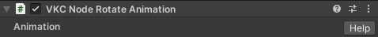
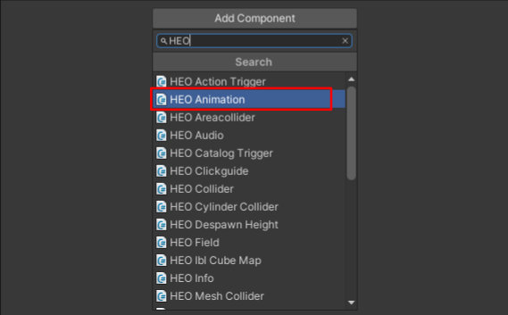
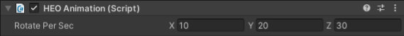
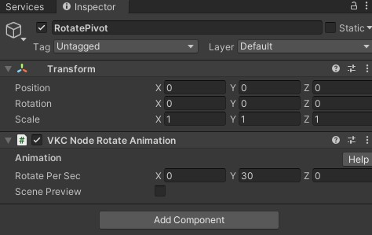
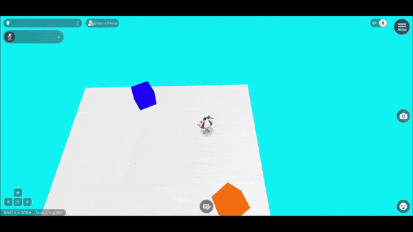

# VKC Node Rotate Animation

`VKC Node Rotate Animation`をアタッチしたオブジェクトに回転アニメーションを再生します。 
アニメーションはループで再生されます。

| Label | function |
| ---- | ---- | 
| Rotate Per Sec |1秒間に回転する角度 |

`Rotate Per Sec`の設定値に応じて、それぞれX軸、Y軸、Z軸で回転します。

##　使い方

### オブジェクト自身を中心に回転する

1\. 任意のオブジェクトにインスペクター画面中の`Add Component`から`VKC Node Rotate Animation`をアタッチします。 
例として、ここではCubeに`VKC Node Rotate Animation`をアタッチします。

2\. `VKC Node Rotate Animation`の`Rotate Per Sec`にX軸 / Y軸 / Z軸が1秒間あたりの回転する角度(°)を設定します。

ワールドに入場すると、該当のオブジェクトが自身の中心を起点として回転します。

### 別のオブジェクトを中心軸として回転する

ある親オブジェクトに`VKC Node Rotate Animation`をアタッチし、そのオブジェクトの子要素として回転させたいオブジェクトをつけることで親オブジェクトを中心に回転するオブジェクトを作れます。

1\. 親オブジェクトに`VKC Node Rotate Animation`をアタッチし、秒あたりの回転角度を設定します。 
例として、ここでは回転の中心となる空のゲームオブジェクトを作成し`VKC Node Rotate Animation`を設定します。

2\. 子オブジェクトとして回転させたいオブジェクトを親オブジェクトにドラッグ＆ドロップし、ヒエラルキーにて親子関係を設定します。 
以下の画像ではCubeオブジェクトを子オブジェクトに設定しています。

!!! note
    UnityのSceneビューでは親オブジェクトの位置は含まれる子オブジェクトの中心にあるように表示（下記画像参照）されますが、Inspectorタブの`Transform - Position`は子オブジェクトを持った前後で変化しません。 
    親オブジェクトの位置は`Transform - Position`の値を参照すると良いでしょう。

なお、親子関係を設定した際、子オブジェクトの`Transform - Position`について原点からの距離として表されていた数値が親オブジェクトからの距離の値に変化するため、ご注意ください。

ワールドに入場すると、子オブジェクトが親オブジェクトの中心を起点として回転します。 
このときコライダーの当たり判定も子オブジェクトの回転に応じて移動します。

