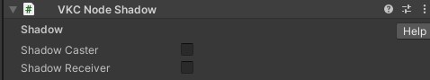

# VKC Node Shadow

VKC Node Shadowは、動的影(シャドウマップ)を設定するために使います。 
本コンポーネントを使用することで、アバターやオブジェクトの動きに合った影を投影することができます。

| 名称 | 機能 |
|----|----|
| Shadow Caster | 影を映し出すオブジェクトとして設定 |
| Shadow Receiver | 影を投影するオブジェクトとして設定 |

## 使い方

1\. [HEOWorldSetting](HEOWorldSetting.md)のRenderingタブにて影を`Round`(丸影)から`Normal Shadow Map`(シャドーマップ)に変更します。

2\. 影を映し出したいオブジェクトにVKC Node Shadowをアタッチし、Shadow Casterにチェックを入れます。

3\. 影を投影したいオブジェクトにVKC Node Shadowをアタッチし、Shadow Recieverにチェックを入れます。 
ここでは影を投影するために床オブジェクトにアタッチします。 
また、ひとつのオブジェクトをCasterとReceiverの両方に設定することも可能です。

4\. ワールドをビルドすると、VKC Node Shadowが設定されたオブジェクトの影がリアルに表現されます。

影には表示距離があり、一定距離離れたオブジェクトは影が徐々に薄くなり、離れると表示されなくなります。

!!! note caution
        VKC Node Shadowで動的影が出力されるのは、VKC Node Shadowをアタッチしたオブジェクトのみになります。 
        [HEOWorldSetting](HEOWorldSetting.md)にて`Normal Shadow Map`が有効になっている場合、VKC Node Shadowがアタッチされていないオブジェクトは影を表示しない + 影が投影されない状態となります。

また、`Shadow Reciever`にチェックが入っていないオブジェクトの場合は影が投影されなくなるためご注意ください。

