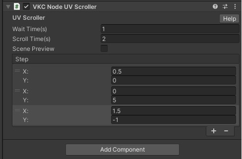
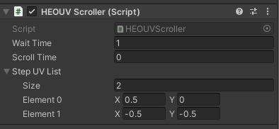
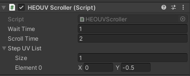

# VKC Node UV Scroller

Sets scroll animation on the UV of the object's material.


| Label | function |
| ---- | ---- |
|Wait Time |Pause time for each scroll |
|Scroll Time|Playback time for one scroll |

## Step UV List
| Label | function |
| ---- | ---- |
| Size | Number of UV scrolls in one set |
|X/Y|X (horizontal) direction/Y (vertical) direction scroll amount|

For example, if you set the following



2 seconds: 0.5 to the left

↓

1 second: stop

↓

2 seconds: 5 downwards

↓

1 second: stop

↓

2 seconds: 1.5 left / 1 up

↓

1 second: stop

↓

...then loop

## Samples
In this example, we will use a texture like this.

!!! info
    SDK Version: 4.1.4<br>
    OS: Windows 10<br>
    Unity: 2019.4.31.f1<br>
    Browser: Google Chrome


### Instant Switch Sample
We will create a sample that switches instantly after being displayed for a certain amount of time. As an example, first, create a Quad and configure its material settings as follows.


This will display only the top-left image. Next, add the VKCNodeUVScroller component to the Quad object and configure it as follows.



The “Wait Time” is the duration (in seconds) to wait while displaying, and since we are switching instantly, set “Scroll Time” to 0. The “Step UV List” specifies the UV coordinates to add during switching. For the first step, (0.5, 0) is added, moving to the top-right. Next, it moves to the bottom-left, then to the bottom-right, and finally back to the top-left.

!!! note caution
    The top and bottom, as well as the left and right sides of the image, are seamlessly connected.


The actual operation screen is shown below.


### Scroll Sample
We will create a sample that scrolls in a single direction.



With this configuration, the image scrolls upward over 2 seconds after being displayed for 1 second, revealing the bottom-left image. After another 1-second display, it scrolls upward again and returns to the top-left image. The actual operation screen is shown below.


!!! Warning caution
    When you export the HEO file after applying this configuration, the scroll information is added to the material data. Since the information is applied to the material, other objects using the same material will scroll in the same way, so please be aware of this.

    If there are objects with a shared material located above the object with the VKCNodeUVScroller component in the Hierarchy, scrolling may not work properly.

    If you replace the texture of the object with the VKCNodeUVScroller component via JavaScript, an issue may occur where the replaced texture is not displayed correctly.

    When left in the background state and then resumed, the UV scrolling may occur at ultra-high speed for the duration it was left inactive. Unfortunately, this behavior cannot be avoided, but to prevent ultra-high-speed UV scrolling, use the following code-based scrolling method instead.

### Code Scroll Sample
HeliScript provides a method called Item.SetUVOffset, which allows you to freely modify the UV offset of a texture associated with an item.

!!! Code Scroll caution
    `public bool SetUVOffset(string naterialName, float u, float v)`

    Specify a material by name and modify its UV coordinates. If the modification fails, it returns false.

While VKCNodeUVScroller allows scrolling only at fixed intervals and in predetermined patterns, using this method enables scrolling in any direction at any timing, offering greater versatility.

Below is a HeliScript that adjusts the scroll position of a texture based on the movement coordinates when moving over a floor placed at Position(0,0,0) with a Scale(10,1,10).

```
component vketquad
{
    Item m_Item;
    Player m_Player;
    Vector3 player_pos;

    public vketquad()
    {
        m_Item = hsItemGet("World");
        m_Player = hsPlayerGet();
        player_pos = new Vector3();
    }
    public void Update()
    {
        player_pos = m_Player.GetPos();
        m_Item.SetUVOffset("matQuad",(player_pos.x+2.5f)/10,(2.5f-player_pos.z)/10);
    }
}
```

The actual operation screen is shown below.

