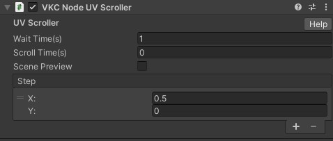
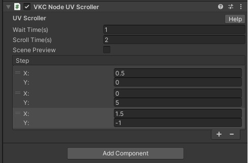
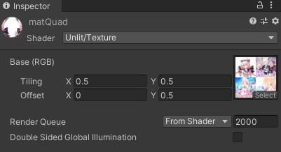
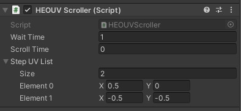
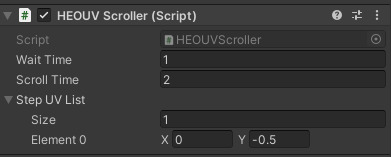

# VKC Node UV Scroller

オブジェクトのマテリアルに設定してあるUVのスクロールアニメーションを設定します



| Label | function |
| ---- | ---- |
| Wait Time |スクロール1回毎の停止時間 |
| Scroll Time |スクロール1回の再生時間 |

## Step UV List
| Label | function |
| ---- | ---- | 
| Size |1セットのUVスクロール数 | 
| X/Y |X(横)方向/Y(縦)方向のスクロール量 | 

例として下記のような設定にした場合



2秒間：左方向に0.5

↓

1秒間：停止

↓

2秒間：下方向に5

↓

1秒間：停止

↓

2秒間：左方向に1.5 / 上方向に1

↓

1秒間：停止

↓

...以降ループ

## サンプル集
ここでの例ではこのようなテクスチャを使用します。


### 即時切り替えサンプル
一定時間表示後、即時切り替えていくサンプルを作成します。まず例としてQuadを作成し、以下のようなマテリアルの設定をおこないます。



これで左上の画像のみ表示されます。 次にそのQuadオブジェクトにVKCNodeUVScrollerコンポーネントを追加し、以下のような設定をおこないます。



「Wait Time」は表示待ちしている時間（秒）で、即時切り替えるので「Scroll Time」は０にします。 「Step UV List」は切り替えていく際に加算していくUV座標で、まず１回目は(0.5, 0)が加算されるので、右上に移動し、次は左下に、最後に右下に移動し、また左上に戻ります。

!!! note caution
    画像の上下と左右はそれぞれ繋がった状態になっています


実際の動作画面は下記の通りです。


### スクロールサンプル
一定方向にスクロールさせるサンプルを作成します。



このように設定すると、１秒間表示後に２秒かけて上方向に画像がスクロールし、左下の画像が表示され、また１秒間表示後に上方向にスクロールし左上画像に戻ります。実際の動作画面は下記の通りです。


!!! 注意点 caution
    この設定をおこなった上でHEOファイルをエクスポートすると、マテリアル情報にこのスクロール情報が追加されます。マテリアルに付与されますので、同じマテリアルを使用している他のオブジェクトも同じようにスクロールしますのでご注意下さい。

    Hierarchyにおいて、VKCNodeUVScrollerがアタッチされているオブジェクトより上に共通マテリアルを持っているオブジェクトがあるとスクロールできない現象が発生します。

    VKCNodeUVScrollerがアタッチされているオブジェクトに対し、JavaScriptよりテクスチャの差し替えを行った場合、差し替え後のテクスチャが上手く表示されない現象が発生します。

    バックグラウンド状態で放置し、復帰した際、放置していた分だけ超高速でUVスクロールが発生します。こればかりはどうしようもないので、超高速UVスクロールを避けるためには↓のコードスクロールを使いましょう。

### コードスクロールサンプル
HeliScriptには、Item.SetUVOffsetというメソッドが用意されており、使用することで、アイテムの持つテクスチャのUVOffsetを自由に変更することができます。

!!! コードによるスクロール caution
    `public bool SetUVOffset(string naterialName, float u, float v)`

    名前でマテリアルを指定し、そのマテリアルの uv座標を変更する。変更に失敗すると false を返す。

VKCNodeUVScrollerでは一定時間おきに一定法則でしかスクロールさせることができませんが、任意のタイミングで自由な方向にスクロールさせることができるため、汎用性が高いです。

下記は、「Position(0,0,0)に設置されたScale(10,1,10)の床の上を移動した際、テクスチャを移動座標に対応したスクロール位置にする」HeliScriptです。

```
component vketquad
{
    Item m_Item;
    Player m_Player;
    Vector3 player_pos;

    public vketquad()
    {
        m_Item = hsItemGet("World");
        m_Player = hsPlayerGet();
        player_pos = new Vector3();
    }
    public void Update()
    {
        player_pos = m_Player.GetPos();
        m_Item.SetUVOffset("matQuad",(player_pos.x+2.5f)/10,(2.5f-player_pos.z)/10);
    }
}
```

実際の動作画面は下記の通りです。


