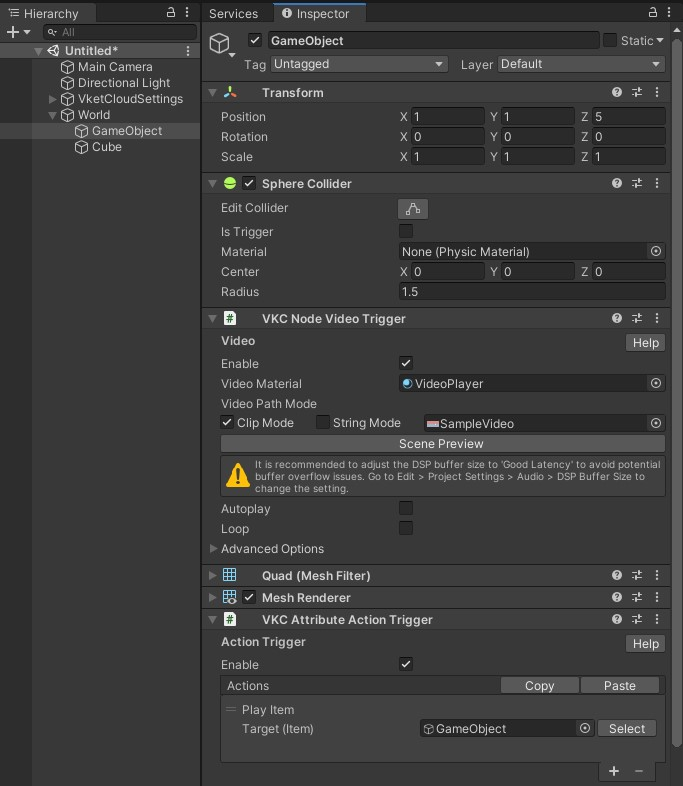

# VKC Node Video Trigger

VKC Node Video Trigger is used to play a video clip.

## How to Use

When placing an object with the VKC Node Video Trigger attached (with Autoplay disabled), the thumbnail with a play button icon will be displayed.

This thumbnail material with a play button can be generated using the later mentioned Thumbnail Tool.

Selecting the object will begin playing the video.

Selecting the object during the video playing will stop the video and return to displaying the thumbnail. This function is same even when Autoplay is enabled.

---

## Basic Settings

| Label | Initial Value | Function |
| ---- | ---- | ---- |
| Enable | true | Enable/disable the click to play for VKC Node Video Trigger. |
| Video Material | VideoPlayer | Specify the material where the video will be displayed. |
| Video Path Mode | Clip Mode / SampleVideo | Specify the path of the video data. By default, a SampleVideo in the SDK will be designated.   `Clip Mode`: designates a video file to be played from the Asset folder.   `String Mode`: designates a video file via string input (e.g. URLs, directory, etc. ). |
| Scene Preview | | Clicking this will play the video in Scene as a preview. |
| Autoplay | false |Specify whether to automatically play the video. Each scene enables a single video to be played at a time.   If more than two objects are designated as `True`, only the last one will be played.  |
| Loop | false | Specify whether the video should loop at the end. |

## Advanced Settings / Thumbnail Tool

The Thumbnail Tool generates a video thumbnail, which is made by designating a thumbnail image and a playbutton icon.

| Label | Initial Value | Function |
| ---- | ---- | ---- |
| Access in VKCItemObject | false | Mode to access a material in [VKC Item Object](VKCItemObject.md) for displaying the video.   On setting this to `true`, specify the target material name on `Target Object Name`.|
| Thumbnail Texture | | Designate a image for video thumbnail. |
| PlayButton Texture | playbutton.png | Designate a playbutton icon to be on the thumbnail image.  |
| Generate Thumbnail Material | | Generate a new thumbnail png image and material using images from Thumbnail Texture and PlayButton Texture.  Saving the generated image and material will automatically allocate them to the Video object. |

## Video Format

Please follow the format below.

| Label | Details |
| ---- | ---- |
| File Format | .mp4 |
| Resolution | 1280x720 H.264 |
| AAC | 44.1 kHz |
| Frame rate | 29.97 or 30 |
| Profile level | 4.1, AAC 44.1kHz, yuv420 |

## About Video Materials

The Shader of the material needs to be Unlit/Texture.

## About VideoPathMode

ClipMode refers to data inside the project. 
StringMode refers to the specified URL. It can be used for video streaming, etc.

!!! note caution
    StringMode is currently able only for internal developers. 
    For playing videos, please use the ClipMode.

## Notes

- Please Make sure to include this object under an object with [VKC Item Field](VKCItemField.md), as this object will not be displayed unless included into another Item.  

- VketCloudSDK enables only a single video to be played at a time. To make a pseudo-display of multiple videos, split the display within one video to two, and designate the display range within the screen's material.

- If you don't set autoplay, you need to control the start of playback by some means, such as an action. The below image uses [VKC Attribute Action Trigger](VKCAttributeActionTrigger.md) to implement video playback on click.

!!! note caution
    The SDK does not support distance falloff for video audio. 
    As an alternative implementation, the [VKC Item Area Collider](../VKCComponents/VKCItemAreaCollider.md) and [StopVideo Action](../Actions/Others/StopVideo.md) can be used to stop the video when the player goes out from a certain range.

!!! caution "VKC Node Video Trigger in Activity"
    On SDK Ver12.3.4 and later versions, VKC Node Video Trigger can be included on exporting Activity using [VKC Activity Exporter](../SDKTools/VKCActivityExporter.md). 
    However, as Autoplay cannot be enabled in Activity, the player must manually click or use the [VKC Item Area Collider](../VKCComponents/VKCItemAreaCollider.md) to play the video.
