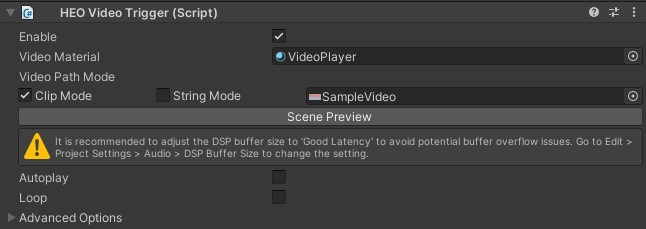
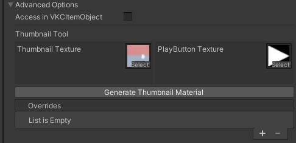
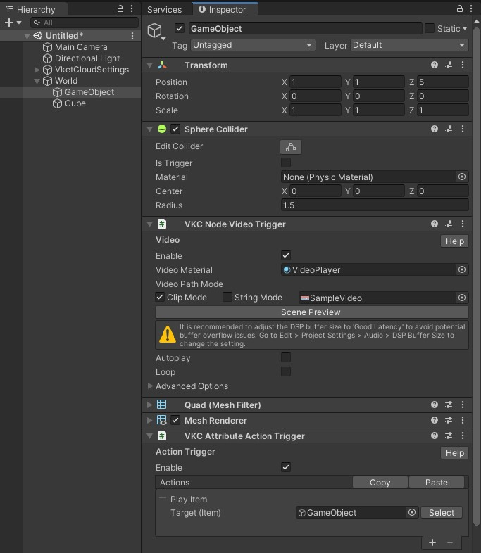

# VKC Node Video Trigger

VKC Node Video Triggerは動画を再生するために使用します。

## 使い方

Autoplayが無効な初期状態でVKC Node Video Triggerをアタッチしたオブジェクトをワールドに設置すると、画像のようにサムネイルと再生ボタンアイコンが重なったマテリアルが表示されます。

サムネイルと再生ボタンアイコンが重なった状態のマテリアルは後述のThumbnail Toolによって作成できます。

上記の状態でオブジェクトを選択すると、動画の再生が開始されます。

動画再生中にオブジェクトを選択すると、動画再生を終了しサムネイル表示に戻ります。なお、本挙動はAutoplayが有効な時も同様です。

---

## 設定項目

| 名称 | 初期値 | 機能 |
| ---- | ---- | ---- |
| Enable | true | ビデオトリガーのクリック判定を有効にします。 |
| Video Material | VideoPlayer | 動画を表示するマテリアルを指定します。 |
| Video Path Mode | Clip Mode / SampleVideo | ビデオのパスを指定します。初期状態ではSDK内蔵のSampleVideoが設定されています。  Clip Mode：Asset上の動画ファイルを指定するためのモードです。  String Mode：URL等、文字列で指定するためのモードです。 |
| Scene Preview | | クリックすると動作確認としてSceneにて動画を再生します。 |
| Autoplay | false | 動画を自動で再生するか指定します。 シーン上で同時に再生可能なビデオは1つのみです。  シーン上にこれをTrueにしたオブジェクトが2つ以上ある場合、最後のもののみが流れます。 |
| Loop | false | 動画が終了した際にループ再生するか指定します。|

## 詳細設定 / Thumbnail Tool

Thumbnail Toolでは動画再生前のサムネイルとして、サムネイル画像と再生アイコンを重ねたテクスチャが割り当てられたマテリアルを作成できます。

| 名称 | 初期値 | 機能 |
| ---- | ---- | ---- |
| Access in VKCItemObject | false | 映像反映対象を[VKC Item Object](VKCItemObject.md)内のマテリアルにするためのモードです。  `True`にした場合に表示される`Target Object Name`には、対象となるマテリアル名を記載してください。 |
| Thumbnail Texture | | 動画のサムネイルとなる画像を指定します。 |
| PlayButton Texture | playbutton.png | サムネイルの上に重ねる再生アイコンを指定します。 |
| Generate Thumbnail Material | | Thumbnail Texture と PlayButton Textureを重ねたpng画像とマテリアルを生成します。 サムネイル画像とマテリアルを保存するとVideoTriggerのサムネイルとして自動で設定されます。 |

## 使用する動画ファイルについて

以下のフォーマットに従ってください。

| Label | 詳細 |
| ---- | ---- |
| ファイル形式 | .mp4 |
| 解像度 | 1280x720 H.264 |
| AAC | 44.1kHz |
| フレームレート | 29.97 or 30 |
| プロファイルレベル | 4.1, AAC 44.1kHz, yuv420 |

## VideoMaterialについて

マテリアルに使用するShaderはUnlit/Textureである必要があります。

## VideoPathModeについて

ClipModeはプロジェクトの内部にあるデータを参照します。 
StringModeはURLを指定して参照します。動画ストリーミング等に利用できます。

!!! note caution
    StringModeは現在内部開発者向けの機能となっております。 
    動画を再生する際はClipModeをご利用ください。

## 注意事項

- 本コンポーネントだけでは動画オブジェクトをItemとして表示できないため、[VKC Item Field](VKCItemField.md)下に必ず配置してください。

- Vket Cloud SDKでは複数のビデオを同時に再生できない仕様です。 複数のビデオを同時に再生しているように見せかけたい場合、動画ファイル内で画面分割を行い、映し出す側のスクリーンで動画の映し出す範囲を調整することで可能です。

- EnableとAutoplayが無効な場合にはアクション等いずれかの手段で再生開始をコントロールする必要があります。 

以下の画像では[VKC Attribute Action Trigger](VKCAttributeActionTrigger.md)を使用したクリックによる動画再生を実装しています。

!!! note caution
    動画音声は距離減衰に対応していません。 
    代替の実装として、動画から一定距離を離れた際に再生を停止させたい場合は[VKC Item Area Collider](../VKCComponents/VKCItemAreaCollider.md)と[StopVideoアクション](../Actions/Others/StopVideo.md)を使用してください。

!!! caution "Activityエクスポート時のVKC Node Video Triggerについて"
    SDK Ver12.3.4以降では[VKC Activity Exporter](../SDKTools/VKCActivityExporter.md)にてアクティビティを出力する際、VKC Node Video Triggerをアクティビティに含めてエクスポートすることができるようになりました。 
    ただしAutoplayには対応していないため、動画を再生する際は手動クリックあるいは[VKC Item Area Collider](../VKCComponents/VKCItemAreaCollider.md)による再生を行う必要があります。
