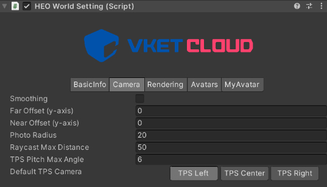

# VKC Setting Camera

VKC Setting Camera is a component for configuring camera behavior settings.

!!! info "About this Component"
    This component is one of the VKC Setting components and allows individual configuration of camera controls within the world.

This component allows you to control camera movement and restrictions within the world in detail.

---

## Basic Settings

This section describes each parameter of VKC Setting Camera.

| Label | Initial Value | function |
| ---- | ---- | ---- |
| Smoothing | false | Set whether or not the smoothing is applied to the camera movement. |
| Far Offset (y-axis) | 0.0 | Shift the focus point of TPS camera up and down. |
| Near Offset (y-axis) | 0.0 | Shift the focus point of TPS camera up and down. |
| Photo Radius | 20.0 | Set the radius of movable range for the photo mode camera. |
| Raycast Max Distance | 50.0 | Set the maximum raycast distance from the click detection camera in meter. |
| TPS Pitch Max Angle | 6.0 | Set the maximum pitch angle for the TPS camera.  If the player sets the "Eye-level" on the in-world settings to "High", this value will be applied.  If set to "Medium", the halved value will be applied. |
| TPS Camera Max Distance | 10.0 | Set the TPS Camera's maximum zoom-out distance. |
| Enable X Rotation | true | When set to false, the rotation of the camera on th X-axis is restricted, preventing the ability to look up or down. |
| Default TPS Camera | TPS Center | Set the offset for the TPS camera.  Can be switched via the third-person viewpoint position in the world settings. `TPS Center`: right behind (default) `right`: Over the right shoulder（Typical TPS Camera-style）`left`: Over the left shoulder |

## Usage Examples

### Basic Camera Configuration
Recommended settings for typical worlds:

- **Smoothing**: true (for smooth camera movement)
- **TPS Pitch Max Angle**: 45.0 (for wider viewing angle)
- **TPS Camera Max Distance**: 15.0 (for moderate zoom-out distance)

### Restrictive Camera Configuration
When you want to limit camera movement in specific areas:

- **Enable X Rotation**: false (disable vertical camera movement)
- **Photo Radius**: 5.0 (restrict movement range in photo mode)

## Related Components

This component works in conjunction with the following settings:

- [VKCSettingWorldCamera](../VketCloudSettings/CameraSettings.md) - World-wide camera settings
- VKCItemCamera - Individual camera object settings

## Notes

- Camera setting changes will take effect after world build
- Extreme values may reduce usability
- Some settings may behave differently in mobile environments