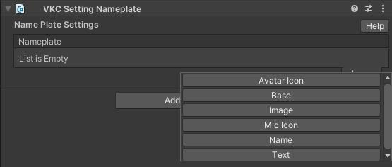

# VKC Setting Nameplate

VKC Setting Nameplate is the component used for customizing the nameplate shown above the player avatar.

By adding each elements in the List, the player nameplate will be customized after build according to the settings.

---

## Avatar Icon

This customizes the avatar icon on the left of the nameplate.

| Label | Initial Value | Function |
| ---- | ---- | ---- |
| Show | false | Toggles Show/Hide of the avatar icon. |
| Adjust Position | false | Adjust the relative position of the avatar icon. `adjustoffsetN` is offset from the avatar icon's baseTextures 0,1, and 2. The initial value is a sample, and Adjust Position must be true to enable adjustment. |
| Position | 0,0,0 | The billboard polygon has a 2.0 width between -0.1~0.1 on each XY axis, which can be adjusted to move the avatar icon's position. |
| Scale | 0,0,0 | Adjust the scale of the avatar icon. |
| Z | 0 | Adjust the draw order of the avatar icon. smaller valued elements will be drawn first. |

## Base

This customizes the base element of the nameplate.

| Label | Initial Value | Function |
| ---- | ---- | ---- |
| Show | false | Toggles Show/Hide of the nameplate base. |

## Image

This adds an image to be displayed other than the nameplate.

| Label | Initial Value | Function |
| ---- | ---- | ---- |
| Name |  | Designates a name for the image (which will not affect in-world display). This can be used as a label for the image for convenience. (e.g. Base White). |
| Image(.png) | none | Designates an image (such as icons) to be displayed on the nameplate other than the avatar icon.
| Position | 0,0,0 | The billboard polygon has a 2.0 width between -0.1~0.1 on each XY axis, which can be adjusted to move the image's position. |
| Scale | 0,0,0 | Adjust the scale of the image. |
| Z | 0 | Adjust the draw order of the image. smaller valued elements will be drawn first. |

As an example, by using this setting a white image can be displayed as below:

## Mic Icon

This customizes the Mic Icon element of the nameplate.

| Label | Initial Value | Function |
| ---- | ---- | ---- |
| Show | false | Toggles Show/Hide of the mic icon. |
| Adjust Position | false | Adjust the relative position of the mic icon. `adjustoffsetN` is offset from the mic icon's baseTextures 0,1, and 2. The initial value is a sample, and Adjust Position must be true to enable adjustment. |
| Position | 0,0,0 | The billboard polygon has a 2.0 width between -0.1~0.1 on each XY axis, which can be adjusted to move the mic icon's position. |
| Scale | 0,0,0 | Adjust the scale of the mic icon. |
| Z | 0 | Adjust the draw order of the mic icon. smaller valued elements will be drawn first. |

## Name

This customizes the name element of the nameplate.

| Label | Initial Value | Function |
| ---- | ---- | ---- |
| Show | false | Toggles Show/Hide of the name. |

## Text

This adds a text element to display other than the player's name.

| Label | Initial Value | Function |
| ---- | ---- | ---- |
| Name |  | Designates a name for the text (which will not affect in-world display). This can be used as a label for the text for convenience. |
| Font Size | 0 | Designates the font size.  |
| Texture Size | 0,0 | Designates the texture size of the text's background. **Caution: This value must be a power of 2!** |
| Color |　black | Designates the text color. |
| Text | | Designates the text to be displayed. |
| Position | 0,0,0 | The billboard polygon has a 2.0 width between -0.1~0.1 on each XY axis, which can be adjusted to move the text's position. |
| Scale | 0,0,0 | Adjust the scale of the text. |
| Z | 0 | Adjust the draw order of the text. smaller valued elements will be drawn first. |
