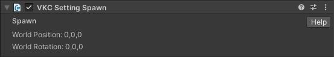
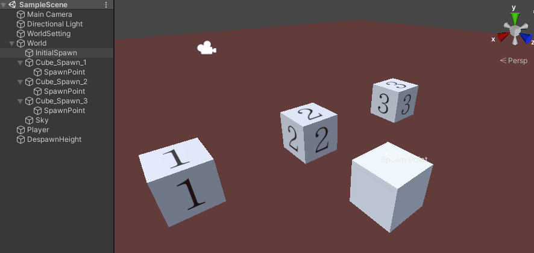
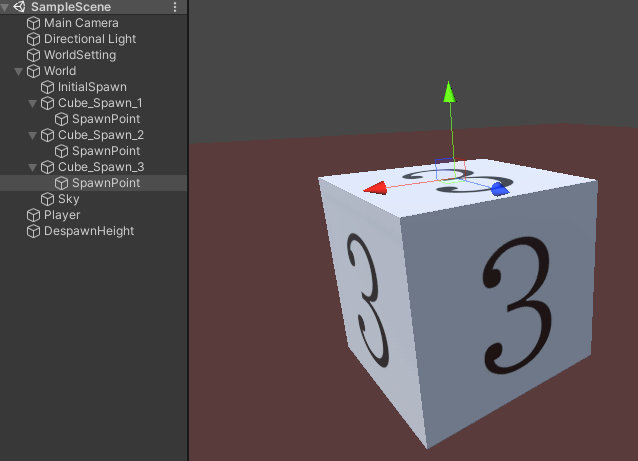
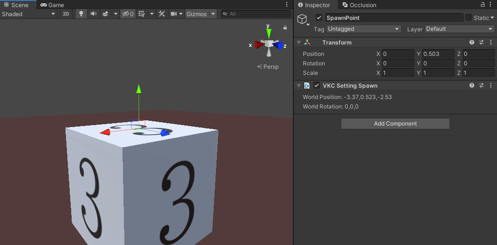
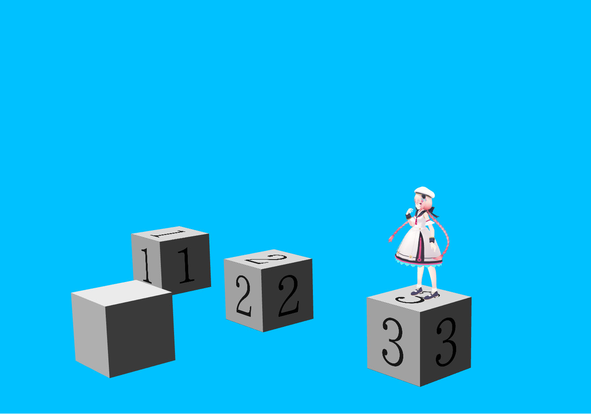
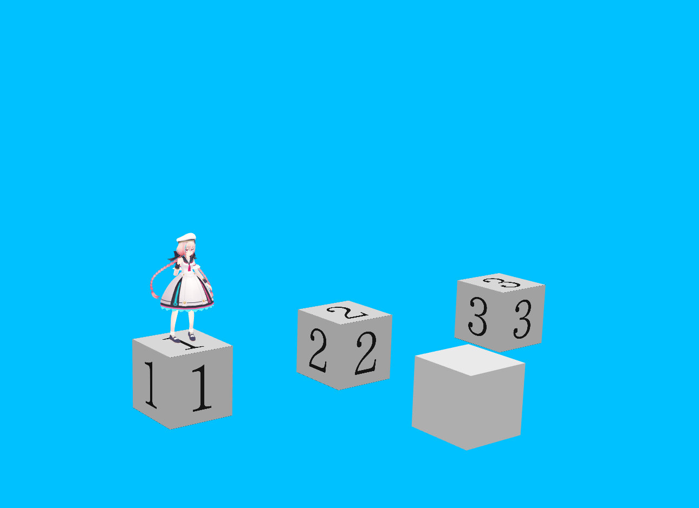
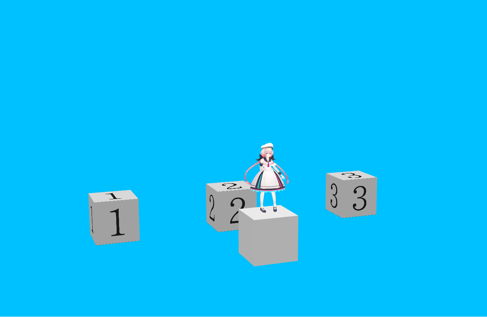

# VKC Setting Spawn

VKC Setting Spawn designates a random spawn point for the player, by placing multiple gameobjects with this component in the world. 

The player will spawn according to the VKC Setting Spawn's World Position and World Rotation. 
On spawn, the TPS camera rotation will be initialilzed with the VKC Setting Spawn's X-axis rotation value added. 
When respawning, the player will be placed on the position of [PlayerSettings](../VketCloudSettings/PlayerSettings.md).

## How to Use

1\. Add multiple gameobjects to designate the spawn points, with attaching the VKC Setting Spawn component.

For example, the `Cube_Spawn_1`~`Cube_Spawn_3` is added to the world, with the VKC Setting Spawn component attached to the `SpawnPoint` child object.

　

Also, to avoid the player being buried to the ground on spawning, the `SpawnPoint` position is designated to be on the cube.

　

2\. Enter the world, and check that the player's initial spawn position changes randomly, as below:

　

　

3\. When respawning after actions such as falling down than the despawn height, the respawn position will be the [PlayerSettings](../VketCloudSettings/PlayerSettings.md)'s position.

　