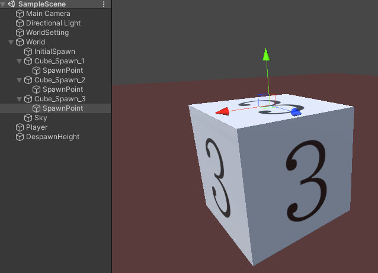
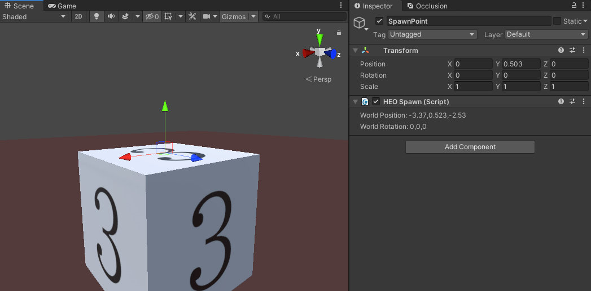
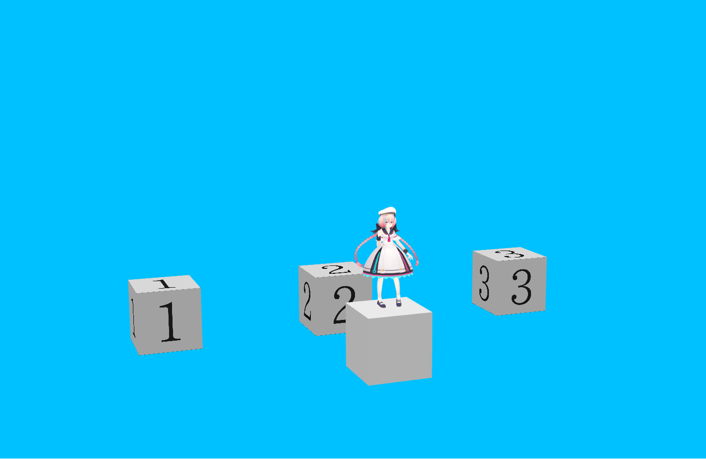

# VKC Setting Spawn

VKC Setting Spawnは、ワールド内に本コンポーネントをアタッチしたゲームオブジェクトを複数置くことでプレイヤーの入場時のスポーン（初期配置）位置をランダムに決定します。

プレイヤーはVKC Setting SpawnのWorld Position 及び World Rotationの座標に沿ってスポーンします。 
なお、三人称視点時のカメラはスポーン時にVKC Setting SpawnのX軸回転値が加わった角度で初期配置されます。 
リスポーン時にプレイヤーは[HEOPlayer](HEOPlayer.md)の位置に配置されます。

なお、[シングルプレイモード](HEOWorldSetting.md)では[HEOPlayer](HEOPlayer.md)の回転値が反映されます。

## 使い方

1\. スポーン位置の対象となるゲームオブジェクトを複数用意し、それぞれにVKC Setting Spawnコンポーネントを付けます。

例として、ここでは`Cube_Spawn_1`~`Cube_Spawn_3`というオブジェクトを用意し、それぞれの子オブジェクト`SpawnPoint`に対してVKC Setting Spawnを付けます。

　

また、プレイヤーが床に埋まるのを回避するために`SpawnPoint`の座標はキューブの上に置きます。

　

2\. ワールドに入場し、プレイヤーのスポーン位置がランダムに変わることを確認します。

　

　

3\. 奈落に落ちるなどの行為によってリスポーンする際は、リスポーン位置が[HEOPlayer](HEOPlayer.md)の位置になります。

　