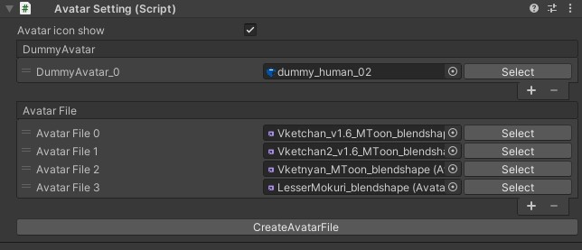

# AvatarSettings

AvatarSettingsはワールド内におけるアバターに関する設定を扱います。

| 名称 | 初期値 | 機能 |
| ---- | ---- | ---- |
| `Dummy Avatar` | dummy_human_02 | 遠方や描画制限がかかった場合に描画するダミーアバターのためのheoファイルを指定します。 |
| `Avatar Files` | Vketchan_v1.6_Mtoon_blendshape | ワールド内にて使える[プリセットアバター](../WorldMakingGuide/PresetAvatar.md)を設定します。 プリセットアバターを設定するには、あらかじめアバター情報をまとめた[アバターファイル](../WorldMakingGuide/AvatarFile.md)を用意します。 |
| `CreateAvatarFile` | | 新規のアバターファイルを生成します。 |

!!! note caution
    `Avatar Files`にて空欄がある / 1つも設定されていない場合はビルドエラーが発生したり、初期状態のアバターが表示されない状態となります。必ず最低1体はアバターを割り当ててください。

SDKでは初期状態のアバターとして用意しているAvatarFileがあるため、空欄が発生している際はこちらをご利用ください。

