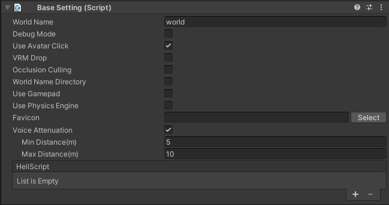

# BasicSettings

BasicSettingsでは、ワールドの基本的な設定を編集できます。

| 名称 | 初期値 | 機能 |
| ---- | ---- | ---- |
|  `World Name` | "world" |  ワールド名を設定する項目です。基本的にはワールド作成時に自動生成されたIDがアップロード時に自動入力され、URLなどに反映されます。  (例：[VketID_of_Creator].cloud.vket.com/worlds/[World_Name])|
|  `Debug Mode` | false |  デバッグモードを切り替えることができます。オンにするとブラウザ上で`F1`または`F2`からデバッグ機能を使用することが可能になります。 詳しくはデバッグモードの[解説ページ](../WorldEditingTips/DebugMode.md)をご確認ください。|
| `Use Avatar Click`| true | 他のプレイヤーをクリックした時に処理を利用するかどうかの設定です。 |
| `VRM Drop` | false | ブラウザ上へのVRMドロップによるローカルの(他プレイヤーから見えない)アバター変更を許可します。 |
| `Occlusion Culling` | false | オクルージョンカリングをオンにします。 詳しい使い方は[オクルージョンカリング](../WorldOptimization/OcclusionCulling.md)をご確認ください。　|
| `World Name Directory` | false | .heoファイルなどの出力時に、ワールド名の付いたフォルダにまとめます。 (例： data/field/`ワールド名`/world.heo)|
| `Use GamePad` | false | ゲームパッドを使用するかどうかの設定です。 |
| `Use Physics Engine` | false | 物理エンジンを使用するかどうかの設定です。|
| `Favicon` | 空欄 | Faviconを設定する項目です。 |
| `Voice Attenuation` | true | プレイヤー音声の距離減衰の有効/無効を切り替えます。 |
| `Min Distance (m)`| 5.0 | 減衰を開始する距離をメートル単位で指定します。 |
| `Max Distance (m)`| 10.0 | 減衰を終了する距離をメートル単位で指定します。|
| `HeliScript` | 空欄 | ワールド内で使用されるHeliScriptが一覧表示されます。[HEOScript](../HEOComponents/HEOScript.md)などで指定したHeliScriptは本項目にリストアップされます。|

!!! note
    `HeliScript`は基本的には自動で項目が追加されますが、ファイルの削除などによって項目に`None`(未指定)または`Missing`が発生する場合があります。
    HeliScriptの項目内が`None`(未指定)または`Missing`の状態はビルドエラーの原因になるため、ご注意ください。

!!! note
        環境にゲームパッドが接続されている状態で`Use GamePad`が有効になっているワールドに入場すると、ゲームパッドによる操作が可能となります。 
        使用するゲームパッドによって操作方法が異なる場合がありますが、基本的には以下の操作が可能です。 
        なお、キー割り当ての変更/追加、ゲームパッドによるカメラ操作の反転については現バージョンでは非対応です。

| 名称 | 機能 |
|----|----|
| 左スティック | アバター移動 |
| 右スティック | カメラ操作 |
| □ / X / Y　| ジャンプ |
| R3（右スティック押し込み）| カメラリセット（初期方向に戻る）|
