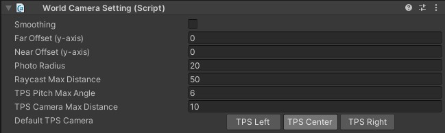

# VKCSettingWorldCamera

VKCSettingWorldCamera specifies the camera's functions.

| Label | Initial Value | function |
| ---- | ---- | ---- |
|  `Smoothing` | false | Set whether or not the smoothing is applied to the camera movement. |
|  `Far Offset (y-axis)` | 0.0 | Shift the focus point of TPS camera up and down. |
|  `Near Offset` | 0.0 | Shift the focus point of TPS camera up and down. |
| `Photo Radius` | 20.0 | Set the radius of movable range for the photo mode camera. |
| `Raycast Max Distance` | 50.0 | Set the maximum raycast distance from the click detection camera in meter. |
| `TPS Pitch Max Angle` | 6.0 | Set the maximum pitch angle for the TPS camera.  If the player sets the "Eye-level" on the in-world settings to "High", this value will be applied.  If set to "Medium", the halved value will be applied. |
| `TPS Camera Max Distance` | 10.0 | Set the TPS Camera's maximum zoom-out distance. |
| `Enable X Rotation` | true | When set to false, the rotation of the camera on th X-axis is restricted, preventing the ability to look up or down. |
| `Default TPS Camera` | TPS Center | Set the offset for the TPS camera. `center`: right behind (default) `right`: Over the right shoulder（Typical TPS Camera-style）`left`: Over the left shoulder |
