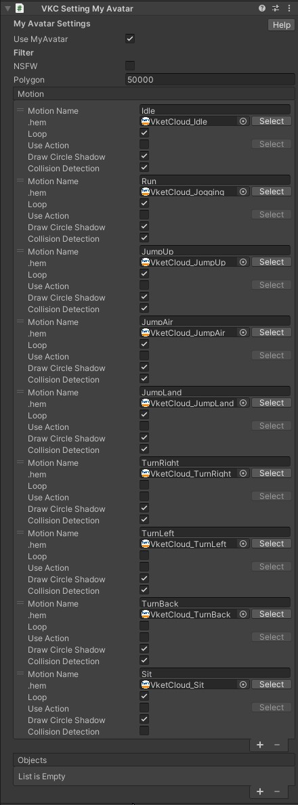

# MyAvatarSettings

MyAvatarSettings handles settings for using [MyAvatars](../AboutVketCloudSDK/SetupAvatar.md) in world.

|  Label | Initial Value | function |
| ----   | ---- | ---- |
| `Use MyAvatar` | true | Enables/Disables Use of MyAvatars in-world. |
| `NSFW` | false |  Restrict the use of NSFW (Not Safe For Work) avatars.|
| `Polygon` | 50000 | Set the upper limit of polygon count for the MyAvatars in this world. |
| `Motion` | | Set the motion to be used by the MyAvatars.|

---

## Motion

|  Label | Initial Value | function |
| ----   | ---- | ---- |
| `Motion Name` | | Set the motion name. |
| `.hem` | | Set the animation file (.hem) to be played on triggering motion. |
| `loop` | true | Play the motion in a loop. |
| `Use Action` | false | Sets the action to call when the motion starts playing.   In particular, enable this setting and designate the action to be fired via `Setting`. By adding a motion without a `.hem` designated, the motion can be used for purposes such as playing particles on playing motion. |
| `Draw Circle Shadow` | true | Sets to draw a circle shadow on playing motion. |
| `Collision Detection` | true | Sets collision detection on playing motion. |

### About Motions

The default motions/animations are set and used by the SDK. 
By [Preparing an animation and replacing](../HEMAnimationConverter/AnimationConverter.md), MyAvatar's idle, walk, turnbacks and other motions can be replaced by the animation. 
To edit motions for preset avatars in world, edit the [Avatar File](../WorldMakingGuide/AvatarFile.md) of the preset avatar.

---

## Objects

Set the objects (.heo files, particles, audio) to be attached to the avatar.  
To use 3D models as an object, the file must be [converted to .heo file](../WorldMakingGuide/HEOExporter_Tutorial.md).

|  Label | Initial Value | function |
| ----   | ---- | ---- |
| `Name` | blank | Set the name of the object. |
| `Object Type` | Heo | Set the type of object.  `Heo`: [.heo file](../WorldMakingGuide/HEOExporter_Tutorial.md), `Hep`: particles, `Audio`: audio |
| `File` | blank | Set the file to be used as an object. |
| `Position`| 0,0,0 | Set the relative position from the Target. |
| `Rotation` | 0,0,0 | Set the relative rotation from the Target. | 
| `Target` | blank | Specifies the bone that serves as the coordinate origin.   The bone name is akin to the [VRM Humanoid](https://vrm.dev/en/univrm/humanoid/humanoid_overview){target=_blank}, name in snakeCase (e.g. head, leftLowerLeg, leftThumbProximal...)|
