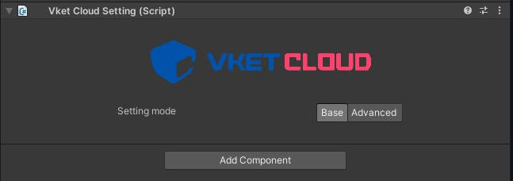

# Vket Cloud Settings - 概要

Vket Cloud Settingsは、SDKVer12.0より導入されたVket Cloudにおけるワールドの設定を管理するためのオブジェクト群です。 
以前のバージョンにおいてワールド設定を管理していた[HEOWorldSetting](../VKCComponents/HEOWorldSetting.md)、[HEOPlayer](../VKCComponents/HEOPlayer.md)、[HEODespawnHeight](../VKCComponents/HEODespawnHeight.md)コンポーネントを複数のSettingsオブジェクトに分解し、より管理しやすく改善されたものです。

!!! note "バージョン引き上げ時の設定の引継ぎについて"
    SDKVer12.0以前に作成されたワールドをVer12.0環境に更新する際、[HEOWorldSetting](../VKCComponents/HEOWorldSetting.md)、[HEOPlayer](../VKCComponents/HEOPlayer.md)、[HEODespawnHeight](../VKCComponents/HEODespawnHeight.md)の各種設定は自動でそれぞれのSettingsオブジェクトに引き継がれます。

## VketCloudSettingsの使い方

UnityのHierarchyパネルで上部を右クリックし、表示されるメニューで**「Add essential objects for VketCloud」**をクリックすると、VketCloudSettingsと各Settingsオブジェクトが生成されます。

"VketCloudSettings"オブジェクトを選択すると、Inspectorでは「Base」と「Advanced」の二種類のモードが表示されます。

生成時の初期状態ではBaseモードが選択されており、このときはワールドの基本となる3種類のSettingsオブジェクトが生成されます。

より詳細に設定を行いたいワールド制作者はAdvancedを選択してRendering, AvatarなどのSettingsオブジェクトを生成・設定できます。

## 設定モードについて

### Base

Baseモードでは[BasicSettings](./BasicSettings.md), [PlayerSettings](./PlayerSettings.md), [DespawnHeightSettings](./DespawnHeightSettings.md)の3種類のSettingsオブジェクトが生成されます。

各設定の詳細は以下の各ページをご参照ください。

- [BasicSettings](./BasicSettings.md)

- [PlayerSettings](./PlayerSettings.md)

- [DespawnHeightSettings](./DespawnHeightSettings.md)

### Advanced

AdvancedモードではBaseモードの各Settingオブジェクトに加え、[CameraSettings](./CameraSettings.md), [RenderingSettings](./RenderingSettings.md), [AvatarSettings](./AvatarSettings.md), [MyAvatarSettings](./MyAvatarSettings.md)の4種類のSettingsオブジェクトが生成されます。

各設定の詳細は以下の各ページをご参照ください。

- [Camera Settings](./CameraSettings.md)
  
- [Rendering Settings](./RenderingSettings.md)

- [Avatar Settings](./AvatarSettings.md)

- [MyAvatar Settings](./MyAvatarSettings.md)
