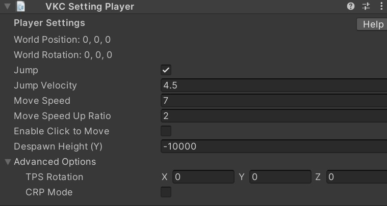

# PlayerSettings

PlayerSettings specifies the settings for the player in the world.

## Basic Settings

| Label | Initial Value | Function |
|----|----|----|
| World Position | Same value as Transform's Position value | Set the player's position on spawn |
| World Rotation | Same value as Transform's Rotation value | Set the player's rotation on spawn.   Note that only the Y-Axis value will be applied |
| Jump | true | Enable/Disable jump in world |
| Jump Velocity | 4.5 | Set the upward velocity for jump in world |
| Move Speed | 7.0 | Set m/s speed for player movement in world |
| Move Speed Up Ratio | 2.0 | Set ratio for speed change when player's dashing |
| Enable Click to Move | false | Set the default value for click movement in the config screen. However, it will be forced to be on when opened with X-embed |
| Despawn Height (Y) | false | Threshold Y coordinate for player to respawn forcibly. The player will respawn if it goes below this value |

The spawn point defined by `World Position` and `World Rotation` will be shown as follows.

## Advanced Settings

| Label | Initial Value | Function |
|----|----|----|
| TPS Rotation | 0,0,0 | Apply the value to the camera's rotation on spawn.   To place the camera on front of the player on entrance, set value to [0.0, 180.0, 0.0] |
| CRP Mode | false | Enable/Disable CRP (protocol for object synchronization on realtime communication).   This is an internal feature, which cannot be used for world creation |

For example, the camera on spawn will be rotated as below if `TPS Rotation` is set to (0,180,0).

