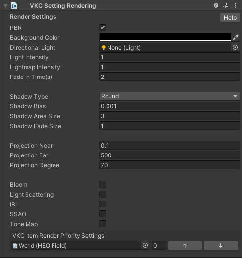

# RenderingSettings

RenderingSettings handles the rendering settings of the world.

|  Label | Initial Value | function |
| ----   | ---- | ---- |
|  `PBR` | true |  Enables PBR lighting. |
| `Background Color` | #000000 | |
| `Directional Light` | blank | Set a Directional Light placed in the scene as the directional light for this world. |
| `Light Intensity` | 1.0 | Set the world light's intensity. |
| `Lightmap Intensity` | 1.0 | Set the light map's intensity. |
| `Fade In Time` | 2.0 | Set the white fade-in length on world enter in seconds.|
| `Shadow Type`| Round | Set the Shadow Type. `round` is a round shadow, and `normalshadowmap` is a normal shadow map.  `normalshadowmap` is used with [HEOShadow](../HEOComponents/HEOShadow.md).|
| `Shadow Bias` | 0.001 | Set the bias value on drawing shadows.|
| `Shadow Area Size` | 3.0 | Set the distance for drawing shadow in meter.|
| `Shadow Fade Size` | 1.0 |Set the fadeout size growing from the shadow's periphery in meter. |
|  `Projection Near`  | 0.1 | Change the near clipping distance.  |
|  `Projection Far`  | 500.0 | Change the far clipping distance.  |
|  `Projection Degree`  | 70.0 | Change the FoV angle. (default value recommended) |
| `Bloom` | false | Enable/disable bloom. |
| `Light Scattering` | false | Enable/disable light scattering. |
| `IBL` | false | Enable/disable IBL, or Image-Based Lighting. |
| `SSAO` | false | Enable/disable SSAO (screen-space ambient occlusion).|
| `Priority List` | | Set the render priority for world objects.   Items with smaller values will be drawn first, and items with the same value will be drawn at the same time. |

---

## Bloom

|  Label | Initial Value | function |
| ----   | ---- | ---- |
| `Bloom` | false | Enable/disable bloom. |
| `Bloom Intensity` | 0.2 | Set the strength of the bloom. |
| `Bloom Threshold` | 0.8 | Set the lower limit of brightness at which the bloom takes effect. |

---

## Light Scattering

|  Label | Initial Value | function |
| ----   | ---- | ---- |
| `Light Scattering` | false | Enable/disable light scattering. |
| `Scattering Intensity` | 0.8 | Set the strength of atmospheric scattering. |
| `Scattering Directivity` | 0.68 | Set the directivity, the degree of concentration of the scattered light. |
| `G` | 0.0 | Set the parameter to adjust the strength of IBL, or Image-Based Lighting. |
| `Distance` | 150.0 | Set the distance at which the light scattering starts. |
| `LightColor` | #FFFFFF | Set the color of the light. |
| `SunColor` | #D9D9FF | Set the color of the sunlight. |

---

## IBL

|  Label | Initial Value | function |
| ----   | ---- | ---- |
| `IBL` | false | Enable/disable IBL, or Image-Based Lighting. |
| `DiffuseSize` | 512 | Set the size of the diffuse map texture. |
| `SpecularSize` | 512 | Set the size of the specular map texture. |
| `SpecularMipMapCount` | 6.0 | Set the amount of mip maps used for the specular cube map. |
| `Diffuse Map` | | Designate the image files for the Diffuse Map. |
| `Specular Map` | | Designate the image files for the Specular Map. |

---

## SSAO

|  Label | Initial Value | Value Range | function |
| ----   | ---- | ---- | ---- |
| `SSAO` | false | Enable/disable SSAO (screen-space ambient occlusion).|
| `Radius` | 0.7 | 0.1 ~ 1.0 | Set range of AO. For precise AO rendering, we recommend to set value within 0.5~0.8. |
| `Self Shadow Counter` | 0.2 | 0.1 ~ 1.0 | Prevents self-shadow counting on planes intended to be without AO.  For precise AO rendering, we recommend to set value within 0.1~0.2. |
| `Attenuation` | 3.0 | 0.0 ~ 3.0 | Prevents AO drawing on distance places behind pillars, floating boards, etc. |
| `Minimum Depth` | 0.02 | 0.0 ~ 0.1 | Adjust occlusion threshold.   Lowering this value may improve AO quality when AO intensity affects open spaces to be dark. (Intended to be left unedited unless needed)  |
| `Color Bleed` | 0.2 |  0.0 ~ 0.4 | Creates a pseudo effect of color bleeding on AO which is caused by light bouncing.  This feature is disabled when value is set to 0.0, or `HSP` is set to false.  |
| `AO Ratio` | 3.0 | 0.25 ~ 5.0 | Set the AO intensity (concentration). |
| `HSP` | true | | If enabled, background color will be blended on the AO black. This will prevent lighter spots from being too dark.  Recommended to be set to `true`. |
| `Fake Bloom` | false | | Designates whether to use the blur sample data for a pseudo-bloom effect.   Effect intensity is determined by `Colbleed` value. |
