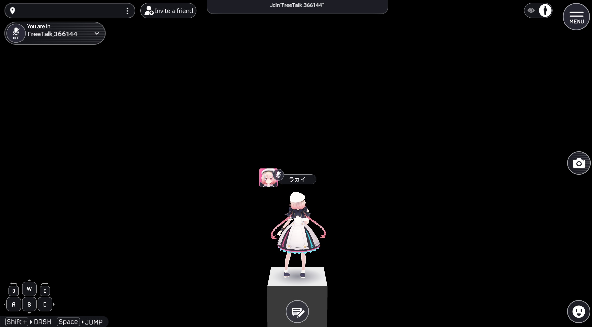

# Build Options

In build settings, creators can perform various operations on the files that make up the world during the build process. There are two ways to change the build settings:

1. You can toggle the simple settings on or off by navigating to **VketCloudSDK > Build Option**.

   

2. To edit the detailed build settings, open the settings window via **VketCloudSDK > Settings** and select the "Build" tab.

   

## Build Option Settings
| Name | Default Value | Function |
| ---- | ------------- | -------- |
| Auto Clear Cache | false | Sets whether to clear the release folder before Build And Run. When enabled, the release folder is cleared before Build And Run. |
| Fast Build Without UI | false | Sets whether to build without displaying the UI. When enabled, the build runs quickly without displaying the UI. |

When Fast Build Without UI is off, the UI is displayed.

When Fast Build Without UI is on, the build and run process is executed quickly without displaying the UI.
## Texture Override Settings

| Label | Initial Value | Function |
| ---- | ---- | ---- |
| Set the texture size to a power of 2 during build | true | Convert texture size depending on the Maxsize designated on the texture's Inspector. |

The texture's MaxSize(convert size on build) can be designated in the Inspector. 
This designates how much the texture will be compressed.

## Model Export Settings

| Label | Initial Value | Function |
| ---- | ---- | ---- |
| Convert the model's texture for smartphone use | false | Optimizes heo file textures for smartphone use by compressing file textures. |

## Avatar Export Settings

| Label | Initial Value | Function |
| ---- | ---- | ---- |
| Convert the avatar's VRM for smartphone use | false | Toggles conversion of vrm files to hrm files, optimizing size and preventing vrm files to be uploaded as resource. |

## Particle Export Settings

| Label | Initial Value | Function |
| ---- | ---- | ---- |
| Convert the particle's texture for smartphone use | false | Optimizes particles for smartphone use by compressing files. |
