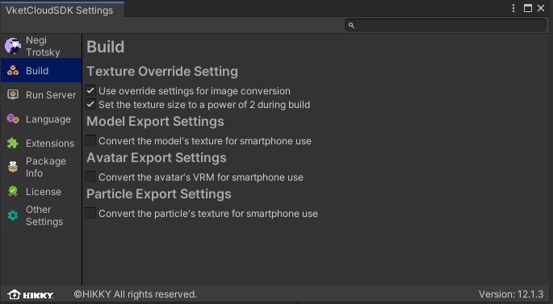

# ビルド時のオプション

ビルド設定において、制作者はビルド時にワールドを構成するファイルに対して様々な操作を行うことができます。
以下２つの方法でビルド時の設定を変更できます。

1. Vket Cloud SDK > Build Optionより、簡易設定をオン/オフすることができます。

2. ビルドの詳細設定を編集するには、Vket Cloud SDK > Settingsより設定ウィンドウを開き、「Build」タブを選択します。

## ビルドオプション設定

| 名称 | 初期値 | 機能 |
| ---- | ---- | ---- |
| Auto Clear Cache | false | Build And Run前にreleaseフォルダを空にする処理を実行するかしないかを設定します。オンにした場合、BuildAndRun前にreleaseフォルダを空にする処理が実行されます。 |

---

## テクスチャオーバーライド設定

| 名称 | 初期値 | 機能 |
| ---- | ---- | ---- |
| Convert texture size to Max size at build time | false | テクスチャのInspectorで指定したMaxSizeを基にファイルを変換します。  Ver13.4から変換方式が変わり、本設定が有効な際のビルド完了までの時間の削減とワールドのロード時間が短縮されました。 |

テクスチャのMaxSize(ビルド時に変換されるサイズ)はInspectorから指定が可能です。 
これによって、どの程度圧縮がかけられるか設定が可能です。 
例として、MaxSizeを64に設定し、「Convert texture size to Max size at build time」をビルド時に有効にすることでロード時間の削減が期待されます。

## モデル書き出し設定

| 名称 | 初期値 | 機能 |
| ---- | ---- | ---- |
| Convert the model's texture for smartphone use | false | heoファイルのテクスチャを圧縮し、スマートフォン用に軽量化します。 |

## アバター書き出し設定

| 名称 | 初期値 | 機能 |
| ---- | ---- | ---- |
| Convert the avatar's VRM for smartphone use | false | vrmファイルをhrmファイルへと変換し、軽量化を行った上でvrmをリソースに置かないように設定します。 |

## パーティクル書き出し設定

| 名称 | 初期値 | 機能 |
| ---- | ---- | ---- |
| Convert the particle's texture for smartphone use | false | パーティクルファイルを圧縮し、スマートフォン用に軽量化します。 |
