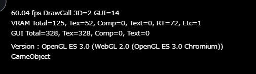
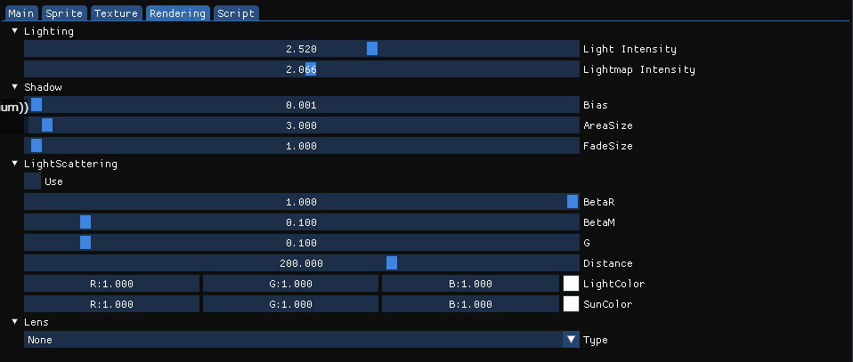
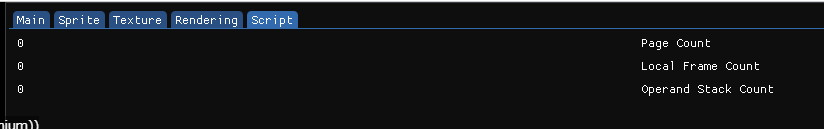

# Debug Mode

By enabling the debug mode on Vket Cloud Settings / [BasicSettings](../VketCloudSettings/BasicSettings.md), various debug features will be available for use on world build.  
When debug mode is enabled, each feature can be toggled using F2~F9 keys.

## Debug Mode: Status Indicator

By enabling the Debug Mode, a status indicator will appear on top of the window.

### 1st Row

| Label | Function |
| ---- | ---- |
| FPS | Current frame per second. |
| DrawCall | DrawCall count for 3D models, and GUI. |

### 2nd Row

| Label | Function |
| ---- | ---- |
| VRAM | Usage of graphics memory in MB. |
| Total | Total memory used. |
| Tex | Memory used for textures. |
| Comp | Memory used for compressed textures. |
| Text | Memory used for displaying text. |
| RT | Memory used for RenderTarget. |
| Etc | Memory used for other usages. |

### 3rd Row

| Label | Function |
| ---- | ---- |
| GUI | Usage of GUI memory. |
| Total | Total memory used.|
| Tex | Memory used for textures. |
| Comp | Memory used for compressed textures. |
| Text | Memory used for displaying text. |

### 4th Row

| Label | Function |
| ---- | ---- |
| Version | Version of WebGL. |

### 5th Row and so on

This row shows text from each components. For example, if [hsSystemWriteLine()](../hs/hs_system_function.md#hssystemwriteline) is called within [VKC Attribute Script](../VKCComponents/VKCAttributeScript.md), the text will be displayed here.

## F2: Display Information UI

Displays a UI showing various information and editable parameters.

### Main

Displays video memory and draw call count.

### Sprite

Displays an overview of UI objects in the current window.  
Each object's name, type, placed layer, position, and scale is shown. 
The grayed-out objects are currently inactive.

Clicking an object from the list will highlight the UI object's position in the screen in yellow. This can be used regardless of active/inactive status.

### Texture

Displays an overview of textures used in the current scene. 
Information includes the texture's usage and size.

### Rendering

Displays a UI to edit parameters of rendering settings.

#### Lighting

Edit light and lightmap strength.

#### Shadow

Edit parameters for dynamic shadows. 
For definition of each parameter, see [RenderingSettings / Shadow](../VketCloudSettings/RenderingSettings.md).

#### LightScattering

Editing each parameters will change the displayed appearance. 
After selecting "Use", each settings will be applied by twitching the parameter bar. 
By selecting "Use" again, the light scattering settings will be unapplied.

For each settings details of light scattering, please refer to the [settings page](../VketCloudSettings/RenderingSettings.md).

Example of settings configured:

#### Lens

This configures the Camera Filter.

Film: filters the image to a vivider tone.  

Mono: filters the image to monochrome tone.

Sepia: filters the image to sepia tone.

### Script

Displays Script information.

#### Script Information

| Label | Function |
| ---- | ---- |
| Page Count | Count of currently active objects (Should be more than 0) |
| Local Frame Count | Stack count of function frames (Should be 0. If it's not, there's a bug somewhere!) |
| Operand Stack Count: | Count of stacks in operand stack (Should be 0. If it's not, there's a bug somewhere!) |

## F3: Display Collision

Displays colliders placed in world. 
SphereColliders will be shown by a round model, and BoxCollider by frames.

*If Mesh Renderer is disabled, clickable colliders in VKC Item Objects will not be shown.

Each color resembles the following colliders:

| Label | Function |
| ---- | ---- |
| Red　| Clickable area. |
| Violet　|　Position of Field object. This is usually on the (0,0,0) origin, which is also placed on the position of VKC Item Activity if any is placed. This is used in same manner as BoxCollider, although this is displayed by a violet model unlike the BoxCollider's frames. |
| Orange　|　Clickable area for player avatar.  |
| Yellow　|　Area Collider.  |
| Green　|　Range of ReflectionProbe. |

## F4: Occlusion Culling

The "OC" indicator will appear on side of draw call information. 
The indicator will disappear when entering F4 again. 

When "OC" is indicated, the occlusion culling will be enabled.

To implement occlusion culling, preparation is needed. 
For details, please refer to the [Occlusion Culling](../WorldOptimization/OcclusionCulling.md) page.

## F5: Display Script Information

Displays Script information. 
This feature displays page count, local frame count, and operand stack count.

Content is same as the Script tab in the debug window which toggled by entering F2.

### Displayed Information on F5

| Label | Function |
| ---- | ---- |
| Page Count | Count of currently active objects (Should be more than 0) |
| Local Frame Count | Stack count of function frames (Should be 0. If it's not, there's a bug somewhere!) |
| Operand Stack Count: | Count of stacks in operand stack (Should be 0. If it's not, there's a bug somewhere!) |

## F6: Ignore Collision

Enables moving space by ignoring collision. 
Jumping will be disabled, and instead the player can move upwards by R key and downwards by F key.

Please note that area collider events will fire even when collision is ignored.

The upward/downward velocity before enabling this will be saved. 
If the player was jumping before pressing F6, the jump will resume when feature is disabled.

Also, easing will not happen on moving up/down during this mode.

## F7: Toggle GUI Information Display

Displays status / information such as positions of GUI elements like Image, Text, and Button.

| Label | Content |
| ---- | ---- |
| Name | The name of GUI element. |
| Show | Shows display status as Show/hide. |
| Pos | Position of element. |
| Z | Depth order. |
| Size | Element size. |
| Pivot | Pivot position of element. |
| Anchor | Information of element anchor.|

## F8: Toggle Status Display

Toggles the status display on top of the window.

## F9: Toggle UI Display

Toggle display of all UI objects on window. By reentering F9, the UI will be displayed. 
This can be used for taking in-world screenshots.

This feature can be used when debug mode is not enabled. 
Note that camera UI cannot be disappeared.

!!! note "Allocated key for Toggle UI Display"
    In previous SDK versions than Ver9.0, the **F1** key was allocated for this feature. Current versions use the **F9** key.
