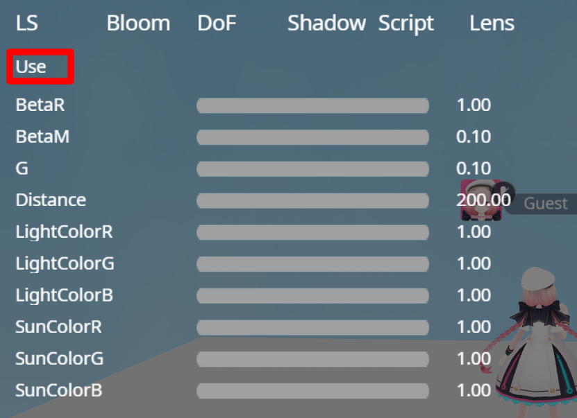

# デバッグモード

[HEOWorldSetting](../HEOComponents/HEOWorldSetting.md)にてデバッグモードを有効にすると、ワールドをビルドした際に様々な検証用機能が使えるようになります。 
デバッグモードが有効なとき、F1～F7キーでデバッグ機能を使うことが出来るようになります。

## F9：UI非表示

画面上に表示されるUIをすべて非表示にすることができます。再度F9を押すことでUIを表示します。 
ワールド内のイメージのスクリーンショットを撮影する際に便利です。

なお、本機能はデバッグモードを作動していない状態でも機能するようになっております。 
ただし、カメラUIを消すことはできません。

Ver9.0以前のSDKでは**F1**キーが割り当てられていましたが、現バージョンではF9で使用できます。

## F2：ライトスキャタリング設定

ライトスキャタリング設定を調整するUIを表示します。
LSタブのUseをクリックし、各パラメータゲージを操作することで色合いを変更することができます。
再度Useをクリックするとライトスキャタリング設定未適用状態に戻ります。

ライトスキャタリング設定については[こちら](../HEOComponents/HEOWorldSetting.md)をご確認ください。

SDK9.0では「Lens」という項目が追加され、カメラフィルターが使えるようになっています。

## F3：当たり判定表示

ワールド内の当たり判定を表示します。
クリック判定は赤色、(0,0,0)地点は紫色、BoxColliderは枠線表示になります。

※Mesh Rendererを無効にした状態でHEOObjectに書き出したクリック判定は表示されません。

また、SDK9.0では以下の3種類が追加されました。具体的には：

・橙　：　プレイヤーのクリック判定です。
・黄　：　エリアコライダーです。
・緑　：　ReflectionProbeの範囲です。

以上の3種類です。

## F4：オクルージョンカリング

ドローコール情報の隣に「OC」の表記が出ます。
再度F4を押すと消えます。
「OC」表示がされている間のみ、オクルージョンカリング機能が有効になります。

オクルージョンカリング機能を使うためには別途準備が必要です。
詳しくは[こちら](../WorldMakingGuide/OcclusionCulling.md)をご確認ください。

## F5：Script情報表示

Script情報を表示します。
ページカウント、ローカルフレームカウント、オペランドスタックカウントの3種類を表示します。

F2で表示されるウィンドウのScriptタブと同様です。

!!! 表示情報について
    - ページカウント： いま生きているオブジェクトの数 (0以上の値になっているはず)
    - ローカルフレームカウント： 関数フレームのスタック状態 (0であるはず。そうでなければ異常)
    - オペランドスタックカウント： 演算用スタックに積まれている要素数 (0であるはず。そうでなければ異常) 

## F6：当たり判定無視

当たり判定を無視して移動できるようになります。
ジャンプ機能が使えなくなるかわりに、Rキーで上方に、Fキーで下方に動くことができます。

しかし、エリアコライダーの侵入退出は発生します。

直前の上下移動の加速度を記憶しており、ジャンプした瞬間にF6を押した場合、
解除時にジャンプが実行されます。

## F7：GUI情報表示

Image、Text、Buttonについて表示状況や座標等の情報を確認することができます。

| 名称 | 内容 |
| ---- | ---- |
| Name | GUIの名称です。|
| Show | 表示状態をShow/hideで示します。 |
| Pos | 座標です。 |
| Z | 表示優先度です。 |
| Size | 大きさです。 |
| Pivot | 中心点です。 |
| Anchor | アンカーの情報です。 |

## F8【SDK9.0】ステータス非表示

画面上部のステータスを非表示にします。