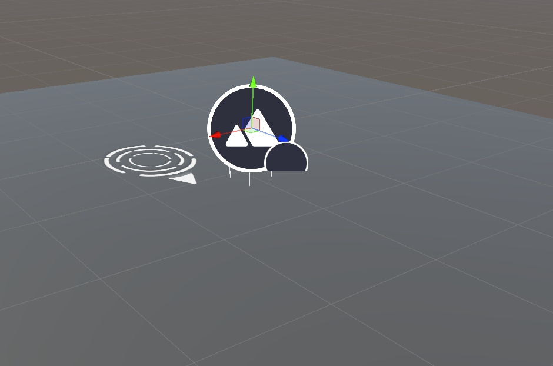
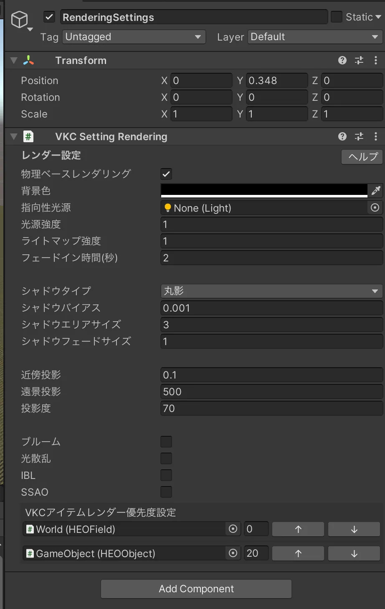
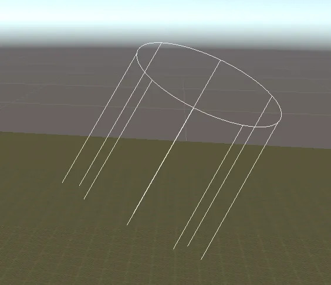
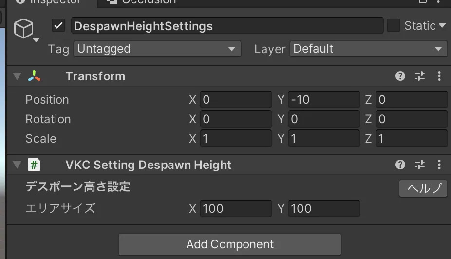
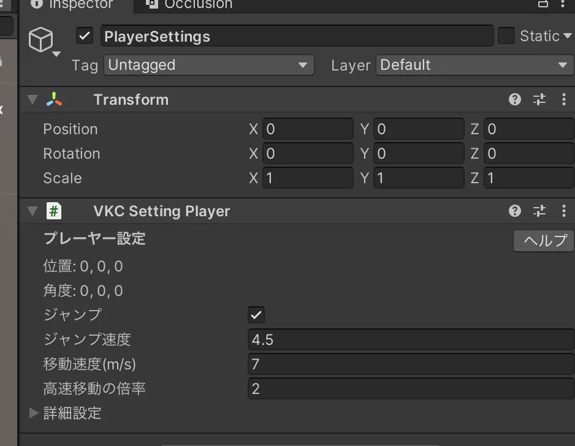
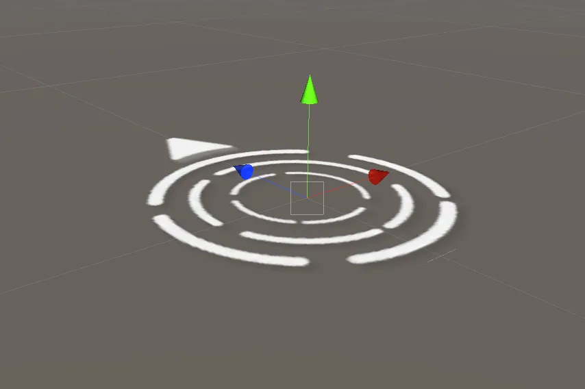

# Displaying Gizmos in the Scene View

When you install the VketCloudSDK, some VKC components will be displayed as gizmos in the Scene view.

## Rendering Setting
If no light is specified in the "Directional Light" field, a gizmo with the default color and direction will be displayed.
If a light is specified in the "Directional Light" field, a gizmo referencing the color and direction of the specified light will be displayed.

## Despawn Height Settings
For objects with this component, a checkerboard pattern in yellow and black will be displayed, representing the area and height within which the object will be reset to its initial position if it falls.

## Player Setting
A gizmo will be displayed to indicate the initial position where the player will enter. 
The direction of the protruding arrow indicates the direction the player will face when they enter.

## Gizmos for Each Item
Icons representing the type and state of the VKCItem object will be displayed at the object's location.

The icon color changes based on the state of the corresponding component: 
White: Normal state 
Yellow: Warning 
Red: Error 

The number below the icon
Displays the render priority number set in the Rendering Settings.

| Component Name | Icon |
|-----------------|-------------------------------------------|
| VKCItemField    |  |
| VKCItemObject   |  |
| VKCItemActivity |  |
| VKCItemParticle |  |
| VKCItemAudio    |  |
| VKCItemPlane    |  |
| VKCItemTextPlane|  |
| VKCItemCamera   |  |
| VKCItemSpot     |  |