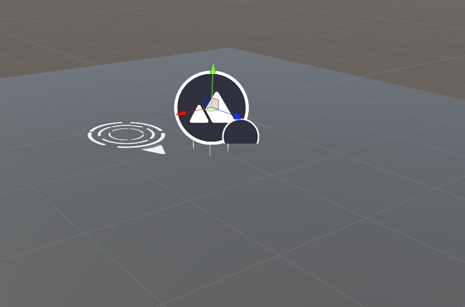
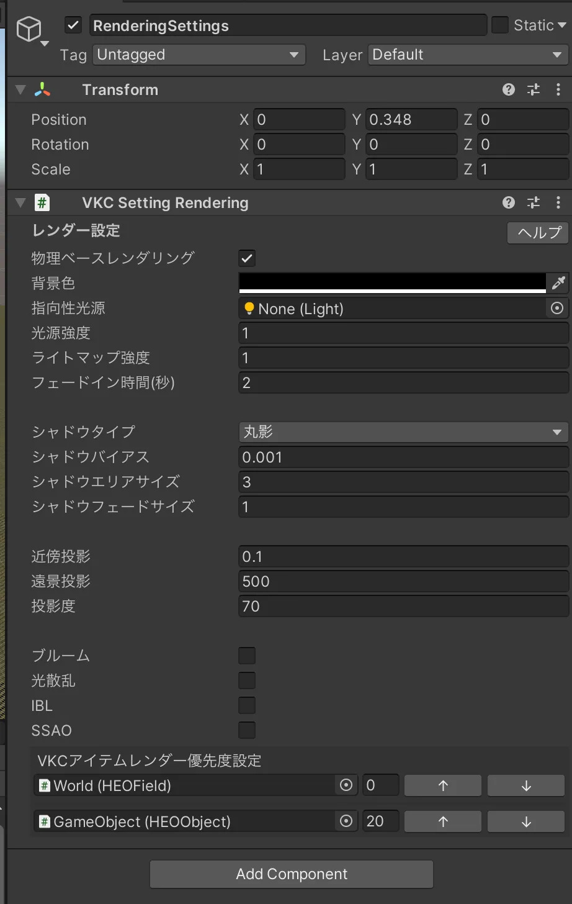
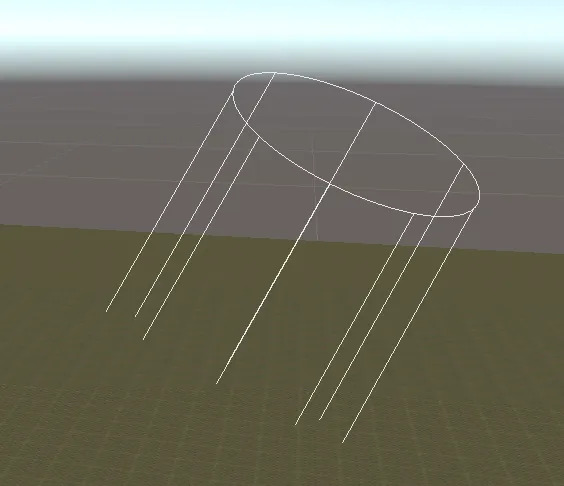
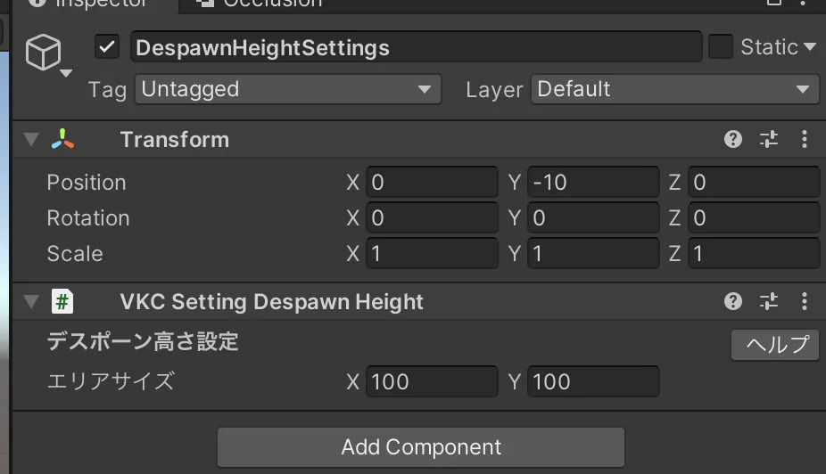
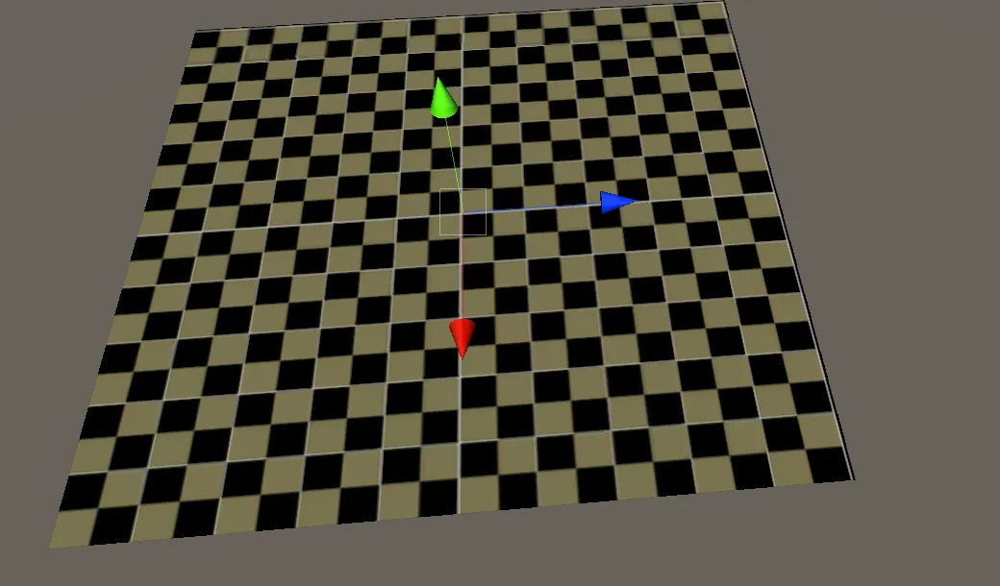
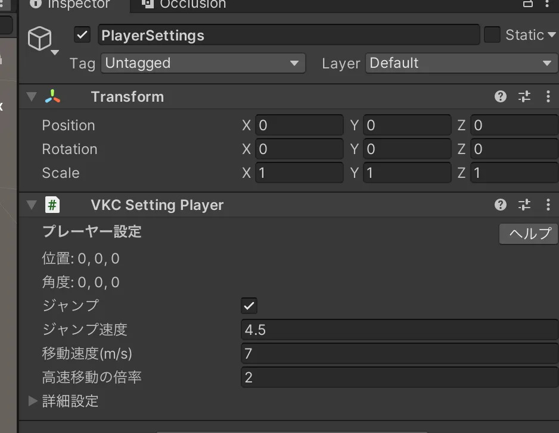
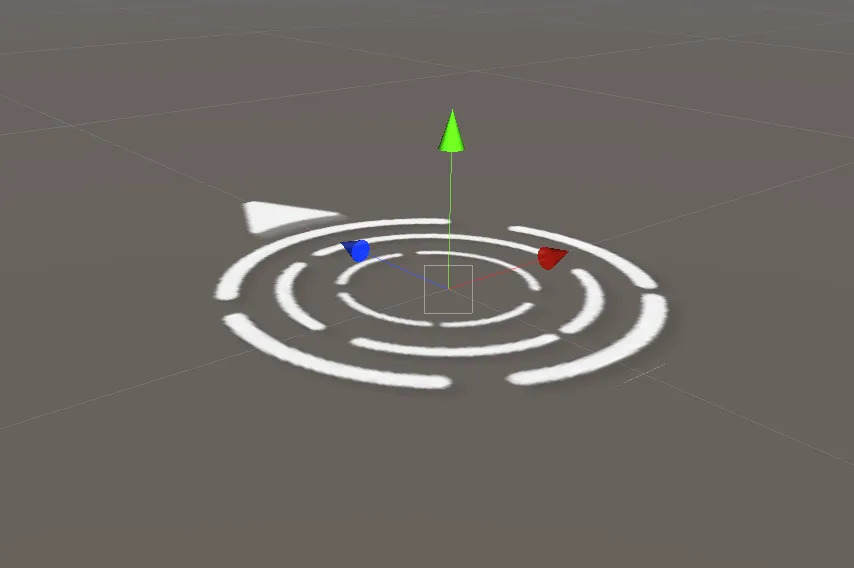
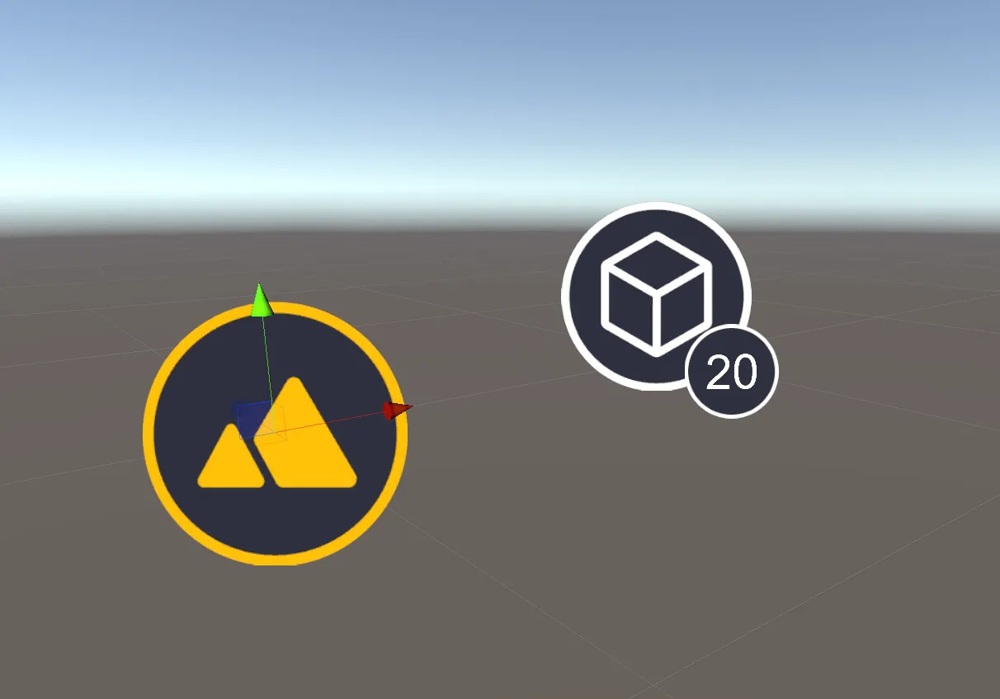
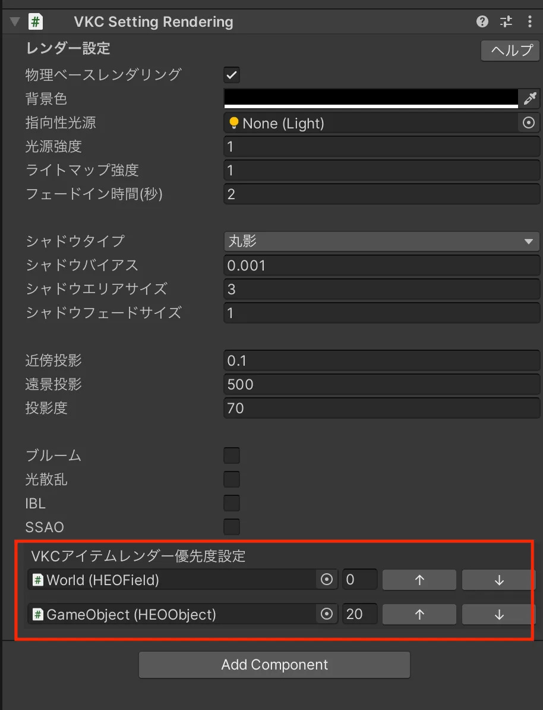

# Sceneビューにおけるギズモの表示

VketCloudSDKを導入すると、Sceneビューに一部のVKCコンポーネントがギズモとして表示されるようになります

## RenderingSetting
「指向性光源」の枠にライトが指定されていない場合、デフォルトの色と向きを持つライトのギズモが表示されます。
「指向性光源」の枠にライトが指定されている場合、指定されたライトの色と向きを参照したギズモが表示されます。

## DespawnHeightSettings
コンポーネントが付いたオブジェクトを中心としてエリアサイズを参照し、黄色と黒の市松模様で落下した際に初期位置に戻る判定の範囲と高さを表示します。

## PlayerSetting
プレイヤーが入場する初期位置であることを示すギズモが表示されます。
飛び出た矢印の向きはプレイヤーが入場した際の向きを示します。

## 各アイテムのギズモ
VKCItemオブジェクトの場所にItemの種類や状態に応じたアイコンが表示されます。

アイコンは該当コンポーネントの状態によって色が変化します 
白：正常な状態です。 
黄：警告が発生しています。 
赤：エラーが発生しています。 

アイコン下の数字
RenderingSettingで設定されているレンダー優先度の数字が表示されています。

| コンポーネント名 | アイコン |
|-----------------|-------------------------------------------|
| VKCItemField    |  |
| VKCItemObject   |  |
| VKCItemActivity |  |
| VKCItemParticle |  |
| VKCItemAudio    |  |
| VKCItemPlane    |  |
| VKCItemTextPlane|  |
| VKCItemCamera   |  |
| VKCItemSpot     |  |
