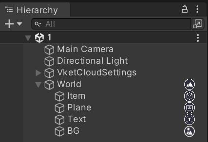

# Hierarchy Icons

After Vket Cloud SDK 14, icons are displayed in the Hierarchy view when VKC components are attached, making it easier to identify which objects have which components.

Furthermore, warnings are highlighted in yellow and errors in red, allowing for quick identification of which objects are causing errors from the Hierarchy view.

The following table lists the icons displayed in the Hierarchy view along with their corresponding VKC components. 
Additionally, the priority for icon display when multiple VKC components are attached follows the order in this table.

| Icon | VKC Components |
| ---- | ---- |
|  | [VKC Item Field](../VKCComponents/VKCItemField.md) |
|  | [VKC Item Object](../VKCComponents/VKCItemObject.md) |
|  | [VKC Item Activity](../VKCComponents/VKCItemActivity.md) |
|  | [VKC Item Area Collider](../VKCComponents/VKCItemAreaCollider.md) |
|  | [VKC Item Plane](../VKCComponents/VKCItemPlane.md) |
|  | [VKC Item Text Plane](../VKCComponents/VKCItemTextPlane.md) |
|  | [VKC Item Audio](../VKCComponents/VKCItemAudio.md) |
|  | [VKC Item Particle](../VKCComponents/VKCItemParticle.md) |
|  | [VKC Item Spot](../VKCComponents/VKCItemSpot.md) |
|  | [VKC Attribute Script](../VKCComponents/VKCAttributeScript.md) |
|  | [VKC Attribute Property](../VKCComponents/VKCAttributeProperty.md) |
|  | [VKC Attribute Action Trigger](../VKCComponents/VKCAttributeActionTrigger.md) |
|  | [VKC Attribute Clickable UI](../VKCComponents/VKCAttributeClickableUI.md) |
|  | [VKC Node Video Trigger](../VKCComponents/VKCNodeVideoTrigger.md) |
|  | [VKC Node Collider](../VKCComponents/VKCNodeCollider.md) |
|  | [VKC Item Background Texture](../VKCComponents/VKCItemBackgroundTexture.md) |
|  | [VKC Node UV Scroller](../VKCComponents/VKCNodeUVScroller.md) |
|  | [VKC Node Alpha Animation](../VKCComponents/VKCNodeAlphaAnimation.md) |
|  | [VKC Node Rotate Animation](../VKCComponents/VKCNodeRotateAnimation.md) |
|  | [VKC Node Cylinder Collider](../VKCComponents/VKCNodeCylinderCollider.md) |
|  | [VKC Node Blend Shape Translator](../VKCComponents/VKCNodeBlendShapeTranslator.md) |
|  | [VKC Node LOD Level](../VKCComponents/VKCNodeLODLevel.md) |
|  | [VKC Node Mesh Collider](../VKCComponents/VKCNodeMeshCollider.md) |
|  | [VKC Node Mirror](../VKCComponents/VKCNodeMirror.md) |
|  | [VKC Node Reflection Probe Type](../VKCComponents/VKCNodeReflectionProbeType.md) |
|  | [VKC Node Shadow](../VKCComponents/VKCNodeShadow.md) |
|  | [VKC Attribute Show Flag](../VKCComponents/VKCAttributeShowFlag.md) |

Examples of icon displays for errors and warnings are shown below. 
When both an error and a warning are present, the error takes precedence and is displayed in red.

| Normal Icon | Icon when it has warnings | Icon when it has errors |
| ---- | ---- | ---- |
|  |  |  |
