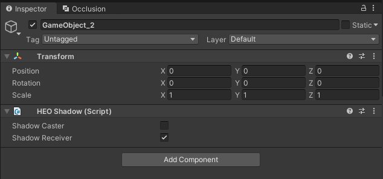

# 複数のHEOコンポーネントの一括編集

Hierarchyにて同じHEOコンポーネントがアタッチされたオブジェクトを選択すると、コンポーネントの設定項目を一括で編集できます。

例として、ここでは[HEOShadow](../HEOComponents/HEOShadow.md)を登録したオブジェクトを二つ用意します。

オブジェクトを複数選択すると、Inspectorでは共通のHEOコンポーネントが表示され、設定の一括編集が可能です。

オブジェクト複数選択時にHEOコンポーネントの設定を編集すると、それぞれのコンポーネントへ設定が適用されます。

なお、複数選択したオブジェクトの内どれかひとつが該当のHEOコンポーネントを有していない場合、あるいは共通のコンポーネントがない場合は以下のように案内が表示され編集ができません。 
本表示が表示された際はオブジェクトの選択を変更するか、Add ComponentでHEOコンポーネントを該当のオブジェクトに追加します。

